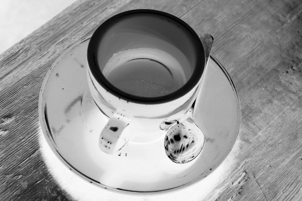
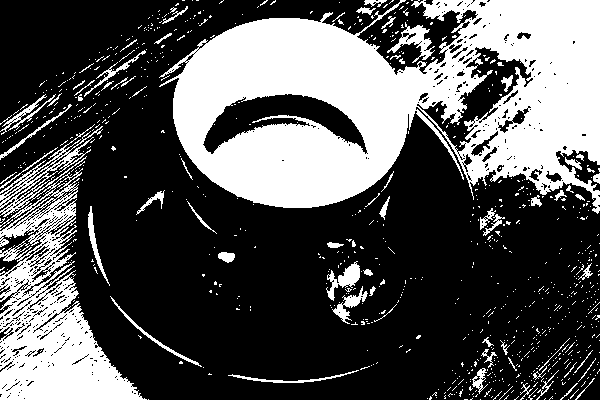
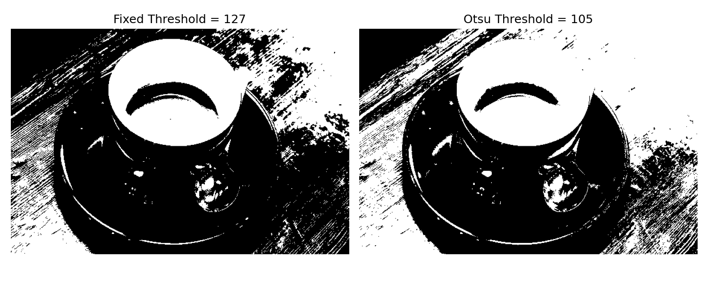
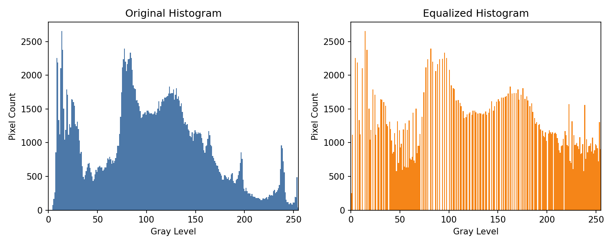
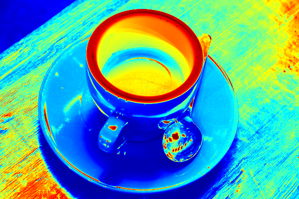
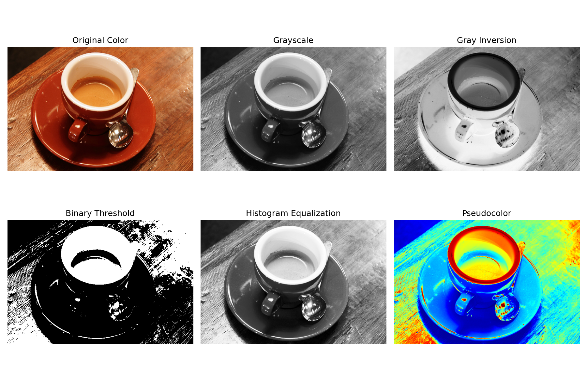

# 实 验 报 告

| 姓名 | 学号 | 专业 | 班级 |
| --- | --- | --- | --- |
| 雷正 | 202434610309 | 人工智能 | 24AI 3 班 |

**课程名称：** 图像处理与机器视觉

**实验名称：** 实验 1 — 空间域点运算

## 设计/实验项目名称

实验 1：空间域点运算（Spatial-Domain Point Operations）。

## 基本内容描述

本实验围绕空间域点运算开展，主要内容如下：

1. 图像读入与显示
2. 彩色图像到灰度图像的转换
3. 灰度反转（公式 `s = 255 − r`）
4. 灰度阈值化（默认阈值 127，并对比 Otsu 自适应阈值）
5. 直方图均衡化
6. 直方图均衡化前后直方图对比显示
7. 同时显示以上各步骤处理结果
8. 选做：灰度图像到伪彩色图像的转换

本实验所用输入图像为一幅咖啡杯彩色照片（`data/input_images/vision_lab_input.png`，来源于 scikit-image 标准测试集 `skimage.data.coffee()`，分辨率 600×400）。该图像包含红色陶瓷杯、奶油色咖啡高光、深色杯托和木纹桌面等多种亮度层次，灰度直方图呈多峰分布，便于直观观察各类点运算的处理效果。

## 实验目的

1. 掌握 Python 图像处理编程环境的基本搭建方法。
2. 掌握 OpenCV 读取、保存和处理图像的基本流程。
3. 理解空间域点运算的特点：每个输出像素只与对应位置的输入像素灰度值有关，不依赖邻域像素。
4. 掌握灰度图转换、灰度反转、灰度阈值化的实现方法。
5. 理解直方图均衡化的基本思想，并能对比均衡化前后的直方图变化。
6. 完成灰度图像到伪彩色图像的转换尝试。

## 实验环境与所用的库

本实验在以下软件环境下开发并运行，所用的 API 在该环境中均得到正确支持：

```text
Python 3.13.11
opencv-python 4.13.0
matplotlib 3.10.8
numpy 2.4.2
scikit-image 0.26.0
```

本实验主要使用的库及其功能如下：

- `cv2`：读取图像、灰度转换、灰度反转、阈值化、直方图均衡化、伪彩色转换和图像保存。
- `numpy`：进行数组表示和像素矩阵运算。
- `matplotlib`：绘制直方图对比图和多图汇总展示图。
- `skimage.data`：提供高质量的标准测试图像（本实验输入图）。
- `pathlib`：管理输入、输出文件路径。

运行方式（在 `week1/` 目录下执行）：

```bash
python3 src/lab1_point_operations.py
```

如使用自定义图片，可执行：

```bash
python3 src/lab1_point_operations.py --input path/to/your_image.png
```

## 实验原理及程序实现

完整源程序见 `lab1_point_operations.py`，关键部分摘录如下。

### 1. 图像读入

使用 `cv2.imread` 以 BGR 三通道形式读入图像；若读取失败则抛出异常进行错误处理。

```python
original = cv2.imread(str(input_path), cv2.IMREAD_COLOR)
if original is None:
    raise FileNotFoundError(f"could not read image: {input_path}")
```

### 2. 灰度图转换

按照 ITU-R BT.601 亮度标准（`Y = 0.299·R + 0.587·G + 0.114·B`），对三通道彩色图执行加权求和得到单通道灰度图。OpenCV 的 `cv2.cvtColor(..., COLOR_BGR2GRAY)` 已封装该计算：

```python
def to_grayscale(image: np.ndarray) -> np.ndarray:
    if image.ndim == 2:
        return _as_uint8(image)
    if image.shape[2] == 3:
        return cv2.cvtColor(_as_uint8(image), cv2.COLOR_BGR2GRAY)
    if image.shape[2] == 4:
        return cv2.cvtColor(_as_uint8(image), cv2.COLOR_BGRA2GRAY)
    raise ValueError(f"expected 3 or 4 color channels, got {image.shape[2]}")
```

### 3. 灰度反转

灰度反转的数学表达式为 `s = L − 1 − r`（这里 `L = 256`，所以 `s = 255 − r`），该变换可以突出原图中的暗区域，常用于医学影像增强：

```python
def gray_inversion(gray: np.ndarray) -> np.ndarray:
    return cv2.subtract(255, to_grayscale(gray))
```

### 4. 灰度阈值化

阈值化将灰度图二值化，便于后续目标分割。本次默认阈值取 `127`，大于阈值的像素置为 `255`，否则置为 `0`：

```python
def threshold_image(gray: np.ndarray, threshold: int = 127) -> np.ndarray:
    _, result = cv2.threshold(to_grayscale(gray), threshold, 255, cv2.THRESH_BINARY)
    return result
```

### 5. 直方图均衡化

直方图均衡化的核心思想是通过累计分布函数将原始灰度分布拉伸到全 [0, 255] 区间，使灰度分布尽可能均匀，从而扩大动态范围、增强整体对比度。OpenCV 已封装该算法：

```python
def equalize_histogram(gray: np.ndarray) -> np.ndarray:
    return cv2.equalizeHist(to_grayscale(gray))
```

### 6. 直方图均衡化前后对比绘制

借助 Matplotlib 同时绘制原灰度图和均衡化结果的直方图，方便观察分布变化：

```python
def plot_histogram_comparison(gray: np.ndarray, equalized: np.ndarray, output_path: Path) -> None:
    fig, axes = plt.subplots(1, 2, figsize=(10, 4), dpi=150)
    axes[0].hist(gray.ravel(), bins=256, range=(0, 256), color="#4c78a8")
    axes[0].set_title("Original Histogram")
    axes[0].set_xlabel("Gray Level")
    axes[0].set_ylabel("Pixel Count")

    axes[1].hist(equalized.ravel(), bins=256, range=(0, 256), color="#f58518")
    axes[1].set_title("Equalized Histogram")
    axes[1].set_xlabel("Gray Level")
    axes[1].set_ylabel("Pixel Count")

    fig.tight_layout()
    fig.savefig(output_path)
    plt.close(fig)
```

### 7. 选做：伪彩色映射

将灰度图按 OpenCV 的 `COLORMAP_JET` 颜色映射表映射到伪彩色，以提升人眼对灰度层次的感知：

```python
def apply_pseudocolor(gray: np.ndarray, colormap: int = cv2.COLORMAP_JET) -> np.ndarray:
    return cv2.applyColorMap(to_grayscale(gray), colormap)
```

## 实验结果与分析

### 1. 处理结果截图

原始输入图像：


灰度图转换结果：


灰度反转结果：



灰度阈值化结果（固定阈值 127）：



固定阈值（127）与 Otsu 自适应阈值的对比：



直方图均衡化结果：


直方图均衡化前后直方图对比：



伪彩色转换结果（选做）：



同时显示以上处理结果：



本次程序共生成以下结果文件：

```text
data/outputs/01_original_color.png
data/outputs/02_grayscale.png
data/outputs/03_gray_inversion.png
data/outputs/04_threshold_binary.png
data/outputs/05_histogram_equalized.png
data/outputs/06_pseudocolor.png
data/outputs/07_histogram_comparison.png
data/outputs/08_all_results.png
data/outputs/09_threshold_otsu.png
data/outputs/10_threshold_compare.png
```

### 2. 定量指标分析

对原灰度图与均衡化后灰度图分别计算均值、标准差、动态范围与信息熵四项指标，结果如下：

| 指标 | 原灰度图 | 均衡化后 | 变化趋势 |
| --- | --- | --- | --- |
| 均值 | 103.65 | 128.21 | 向中央 128 靠拢 |
| 标准差 | 58.12 | 73.48 | 上升约 26%，对比度增强 |
| 动态范围 | [0, 255] | [0, 255] | 仍占满 |
| 信息熵 (bits) | 7.66 | 7.44 | 略有下降 |

均衡化后图像的标准差由 58.12 上升至 73.48，对比度提升约 26%；灰度均值由 103.65 上升至 128.21，整体亮度向中位灰度靠拢，灰度分布更接近全区间均匀分布，达到了扩大动态范围、增强整体对比度的目的。与此同时，信息熵由 7.66 下降到 7.44，说明均衡化所采用的灰度级映射是多对一的，原本不同的灰度级被合并到同一灰度级，部分细节被压缩，这是直方图均衡化在量化层面引入的固有损失，也是该方法在某些场景下可能产生伪轮廓的原因。

### 3. 阈值选取讨论

固定阈值 `127` 将灰度高于 127 的像素判为前景，对于本次咖啡杯图像，前景占比约 **33.46%**，杯口和桌面被分到背景，分割结果偏暗。Otsu 自适应阈值（`cv2.THRESH_OTSU`）自动选出最佳阈值为 **105**，前景占比约 **48.22%**，杯壁和桌面纹理保留更多。两种方法的可视化对比图见上一节。

Otsu 方法通过最大化前景与背景的类间方差自动确定阈值，对本次输入图像取得了更均衡的分割结果；固定阈值 127 实现简单，但其分割效果严重依赖输入图像的整体亮度。该对比表明，即便是最简单的点运算，参数的选取仍直接决定处理结果的质量，在工程实践中应根据具体图像特性自适应地选择阈值。

## 结论

### 1. 实验中的做法

本次实验依次完成了图像读取、灰度变换、灰度反转、灰度阈值化、直方图均衡化、均衡化前后直方图对比、各步骤结果汇总显示以及伪彩色映射。具体做法为：首先用 OpenCV 将彩色图像读入为 BGR 三通道矩阵，再通过 `cv2.cvtColor` 转换为单通道灰度图；随后对灰度矩阵分别执行 `s = 255 − r` 的灰度反转、固定阈值二值化和全局直方图均衡化，并使用 Matplotlib 将处理结果统一保存为可对比的图像；为更全面地评估均衡化效果，对原图与均衡化结果计算了均值、标准差与信息熵等指标，并引入 Otsu 自适应阈值与固定阈值进行对比。

### 2. 遇到的困难及解决方法

实验过程中遇到的主要困难有两个：

1. **通道顺序差异**：OpenCV 默认读入图像的通道顺序是 BGR，而 Matplotlib 显示彩色图像时使用 RGB，如果不进行通道转换，显示颜色会发生偏差。解决方法是在汇总图中使用 `cv2.cvtColor(original, cv2.COLOR_BGR2RGB)` 后再显示。
2. **均衡化效果难以仅靠视觉评估**：直方图均衡化对不同图像的增强效果并不完全相同，仅看处理前后的灰度图像不易判断改善程度，且可能引入噪声或局部伪轮廓。解决方法是同时绘制均衡化前后的直方图，并计算均值、标准差、信息熵等指标，从灰度分布与信息量两个角度量化变化。

### 3. 收获与体会

本次实验加深了我对点运算与邻域运算之间区别的理解：点运算只改变像素自身的灰度值，不改变像素的空间坐标，也不依赖周围像素。各类点运算具有各自的应用价值：灰度反转可以突出原图中的暗区域；阈值化能够将灰度图转换为二值图，便于后续目标分割；直方图均衡化可以扩展灰度分布、增强整体对比度，但同时可能引入噪声放大或局部伪轮廓。从定量数据看，均衡化的实质是以信息熵的轻微损失换取对比度的显著提升。伪彩色映射则说明，同一幅灰度图可以通过颜色编码增强人眼对灰度层次的感知。Otsu 自适应阈值与固定阈值 127 的对比进一步表明，即便是最简单的点运算，参数选择仍是决定处理质量的关键环节。
