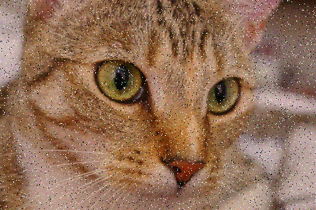
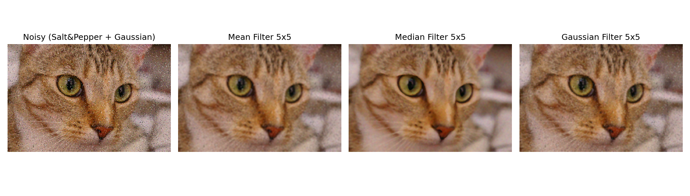
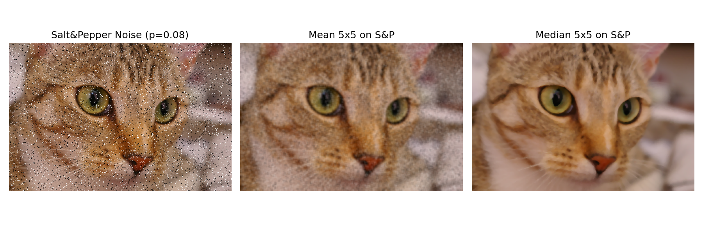
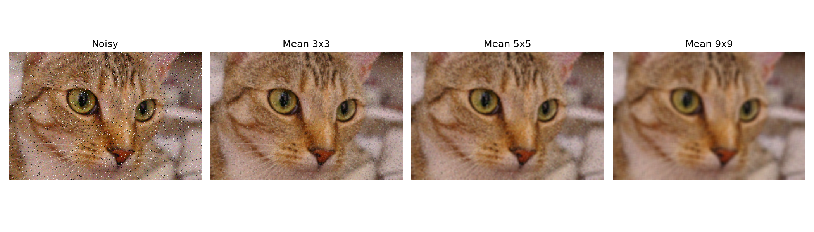
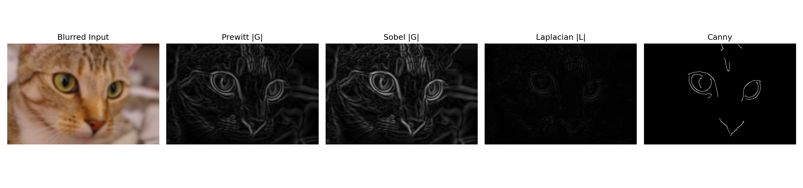
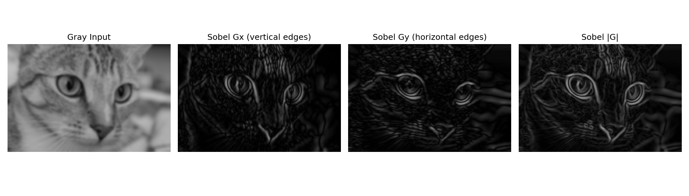
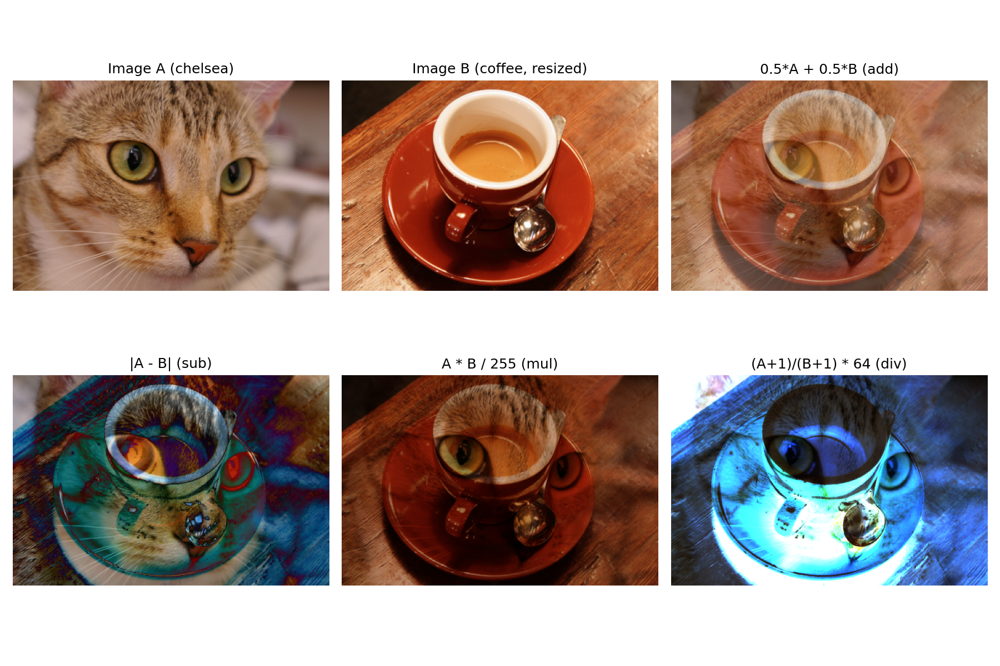
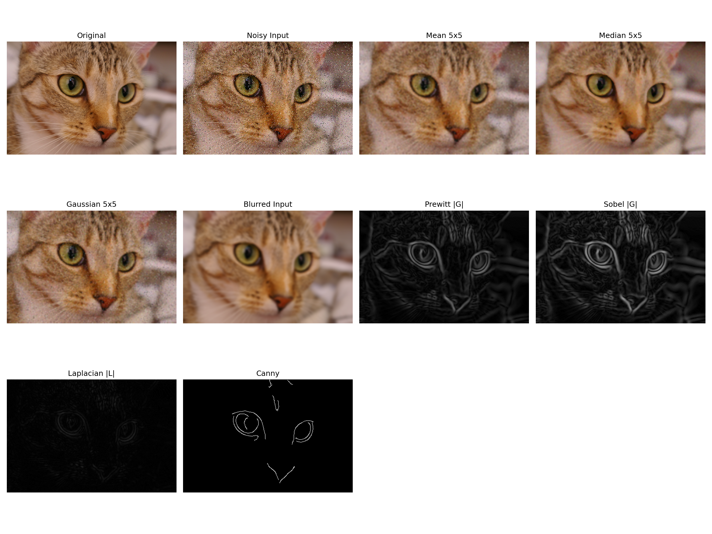

# 实 验 报 告

| 姓名 | 学号 | 专业 | 班级 |
| --- | --- | --- | --- |
| 雷正 | 202434610309 | 人工智能 | 24AI 3 班 |

**课程名称：** 图像处理与机器视觉

**实验名称：** 实验 2 — 空间域邻域滤波

## 设计/实验项目名称

实验 2：空间域邻域滤波（Spatial-Domain Neighborhood Filtering）。

## 基本内容描述

本实验围绕空间域邻域滤波展开，主要内容如下：

1. 选取一幅明显含噪图像，分别使用均值滤波、中值滤波、高斯滤波进行平滑处理。
2. 选取一幅明显模糊图像，分别使用 Prewitt、Sobel、Laplacian、Canny 算子进行锐化／边缘检测。
3. 对上述滤波结果绘制对比图，并从主观视觉与客观指标两个角度分析差异。
4. 选做：对两幅图像执行像素级的代数运算（加、减、乘、除），观察融合与差异效果。

本实验所用主输入图像为 scikit-image 标准测试集中的猫咪彩色照片 `data.chelsea()`（分辨率 300×451，三通道 BGR）。该图像同时包含光滑面（鼻头、眼球高光）、强边缘（猫咪轮廓、瞳孔）、丰富细节纹理（毛发条纹、胡须）等多种结构，既适合观察平滑滤波对噪声与细微纹理的折衷，也便于直观比较不同锐化算子提取边缘的能力。代数运算的辅助图像采用 `data.coffee()`，并经缩放对齐到主图像尺寸。

噪声图与模糊图均由代码自动生成：噪声图先以概率 0.04 加入椒盐噪声，再叠加 σ=12 的零均值高斯噪声；模糊图采用 9×9、σ=2.5 的高斯模糊。

## 实验目的

1. 理解邻域运算与点运算的根本差异：邻域运算的输出像素由其周围像素共同决定，本质是空间域卷积。
2. 掌握三种典型线性／非线性平滑算子（均值、高斯、中值）的实现方式与适用场景。
3. 掌握 Prewitt、Sobel、Laplacian、Canny 四种锐化／边缘检测算子的差异：一阶 vs 二阶、梯度幅值 vs 多阶段优化。
4. 学会用 MSE、PSNR 等指标客观评价平滑结果，避免仅凭视觉做主观判断。
5. 通过代数运算实验，理解像素级算术运算在图像融合、差影法、亮度归一化中的基础作用。

## 实验环境与所用的库

本实验在以下软件环境下开发并运行：

```text
Python 3.13.11
opencv-python 4.13.0
matplotlib 3.10.8
numpy 2.4.2
scikit-image 0.26.0
```

主要使用的库及其功能如下：

- `cv2`：邻域滤波（`blur`、`medianBlur`、`GaussianBlur`）、卷积（`filter2D`）、Sobel/Laplacian/Canny、`convertScaleAbs`、加权融合。
- `numpy`：构造 Prewitt 卷积核、向量化的噪声叠加与代数运算。
- `matplotlib`：多子图对比展示，统一保存为 PNG。
- `skimage.data`：提供 `chelsea()` 与 `coffee()` 两幅可复现的标准测试图。
- `pathlib`：以脚本所在位置为锚定路径，避免依赖当前工作目录。

运行方式（在 `week2/` 目录下执行）：

```bash
python3 src/lab2_spatial_filtering.py
```

如使用自定义图片，可执行：

```bash
python3 src/lab2_spatial_filtering.py --input path/to/your_image.png --aux path/to/aux_image.png
```

## 实验原理及程序实现

完整源程序见 `src/lab2_spatial_filtering.py`，关键部分摘录如下。

### 1. 噪声图与模糊图的构造

为模拟真实场景下的退化，对原图同时叠加椒盐噪声与高斯噪声；锐化实验所用的输入则是高斯模糊后的图像：

```python
def add_salt_and_pepper_noise(image, prob=0.05, seed=20260513):
    rng = np.random.default_rng(seed)
    noisy = image.copy()
    mask = rng.random(image.shape[:2])
    noisy[mask < prob / 2] = 0
    noisy[mask > 1 - prob / 2] = 255
    return noisy

def make_noisy_image(image):
    return add_gaussian_noise(add_salt_and_pepper_noise(image, prob=0.04), sigma=12.0)

def make_blurred_image(image, ksize=9, sigma=2.5):
    return cv2.GaussianBlur(image, (ksize, ksize), sigma)
```

### 2. 均值滤波

均值滤波是最简单的线性低通滤波器，3×3 模板各位置权重均为 1/9。其物理意义是用邻域均值替代中心像素，能够削弱高斯噪声但会同时模糊边缘细节。OpenCV 中通过 `cv2.blur` 直接实现：

```python
def mean_filter(image, ksize=5):
    return cv2.blur(image, (ksize, ksize))
```

关于模板权重为何取 1/9：3×3 邻域内 9 个像素的算术平均要求各权重之和等于 1，且对所有方向各向同性，故每个位置取相同权重 1/9。这一约束保证了滤波前后图像的整体亮度不变。

### 3. 中值滤波

中值滤波是非线性滤波器，输出为邻域内像素值排序后的中位数。它能有效抑制椒盐噪声（极端的"突刺"会被剔除），同时保持边缘清晰：

```python
def median_filter(image, ksize=5):
    return cv2.medianBlur(image, ksize)
```

### 4. 高斯滤波

高斯滤波是加权线性低通滤波，权重按二维高斯函数 G(x, y) = (1 / (2πσ²)) · exp(−(x² + y²) / (2σ²)) 分布，越靠近中心权重越大，因而比均值滤波更好地保留边缘附近的结构：

```python
def gaussian_filter(image, ksize=5, sigma=1.5):
    return cv2.GaussianBlur(image, (ksize, ksize), sigma)
```

### 5. Prewitt 算子

Prewitt 是一阶差分算子，水平与垂直卷积核分别为：

```text
Kx = [[-1, 0, 1],     Ky = [[-1, -1, -1],
      [-1, 0, 1],           [ 0,  0,  0],
      [-1, 0, 1]]           [ 1,  1,  1]]
```

梯度幅值 |G| = √(Gx² + Gy²)。由于权重在垂直方向上对称且不加权中心，Prewitt 对噪声较敏感，但实现简单、计算量小：

```python
def prewitt_operator(gray):
    kx = np.array([[-1, 0, 1], [-1, 0, 1], [-1, 0, 1]], dtype=np.float32)
    ky = np.array([[-1, -1, -1], [0, 0, 0], [1, 1, 1]], dtype=np.float32)
    gx = cv2.filter2D(gray, cv2.CV_32F, kx)
    gy = cv2.filter2D(gray, cv2.CV_32F, ky)
    mag = cv2.magnitude(gx, gy)
    return cv2.convertScaleAbs(gx), cv2.convertScaleAbs(gy), cv2.convertScaleAbs(mag)
```

由于卷积输出存在负值且范围可能超过 [0, 255]，需用 `cv2.convertScaleAbs` 取绝对值并截断为 8 位无符号整数后才能正常显示。

### 6. Sobel 算子

Sobel 与 Prewitt 思路一致，但卷积核对中心行/列加权（系数 ±2），相当于在差分前先做一次小幅高斯加权平滑，因此对噪声的抑制能力优于 Prewitt：

```python
def sobel_operator(gray, ksize=3):
    gx = cv2.Sobel(gray, cv2.CV_32F, 1, 0, ksize=ksize)
    gy = cv2.Sobel(gray, cv2.CV_32F, 0, 1, ksize=ksize)
    mag = cv2.magnitude(gx, gy)
    return cv2.convertScaleAbs(gx), cv2.convertScaleAbs(gy), cv2.convertScaleAbs(mag)
```

### 7. Laplacian 算子

Laplacian 是二阶微分算子，标准 3×3 核为：

```text
L = [[ 0,  1,  0],
     [ 1, -4,  1],
     [ 0,  1,  0]]
```

二阶算子无法直接给出边缘方向，但利用其在边缘处的"零交叉"特性可以定位边缘。Laplacian 同时常用于图像增强：在原图上减去 Laplacian 响应能突出高频细节：

```python
def laplacian_operator(gray, ksize=3):
    return cv2.convertScaleAbs(cv2.Laplacian(gray, cv2.CV_32F, ksize=ksize))

def laplacian_sharpen(image, ksize=3, weight=1.0):
    lap = cv2.Laplacian(image, cv2.CV_32F, ksize=ksize)
    sharp = image.astype(np.float32) - weight * lap
    return np.clip(sharp, 0, 255).astype(np.uint8)
```

### 8. Canny 算子

Canny 是一个多阶段优化的边缘检测算法，包含高斯降噪、梯度计算、非极大值抑制和双阈值连接四个步骤。其目标是在噪声环境下精确、低误检地提取真实边缘：

```python
def canny_operator(gray, low=60, high=150):
    return cv2.Canny(gray, low, high)
```

低阈值 60 用于连接、高阈值 150 用于初筛，比例约为 1:2.5，能在本实验图像上得到既完整又干净的细线边缘。

### 9. 选做：代数运算

像素级代数运算通过对两幅同尺寸图像逐像素执行四则运算实现。为避免溢出，加法以 0.5 权重做线性组合，减法取绝对差，乘法和除法做归一化处理：

```python
def algebraic_operations(a, b):
    if a.shape != b.shape:
        b = cv2.resize(b, (a.shape[1], a.shape[0]), interpolation=cv2.INTER_AREA)
    af = a.astype(np.float32); bf = b.astype(np.float32)
    add = cv2.addWeighted(a, 0.5, b, 0.5, 0)
    sub = cv2.convertScaleAbs(af - bf)
    mul = np.clip(af * bf / 255.0, 0, 255).astype(np.uint8)
    div = np.clip((af + 1.0) / (bf + 1.0) * 64.0, 0, 255).astype(np.uint8)
    return {"add": add, "sub": sub, "mul": mul, "div": div}
```

## 实验结果与分析

### 1. 输入图像

原始彩色输入图（chelsea 猫咪标准测试图）：


合成的含噪图像（椒盐噪声 p=0.04 与 σ=12 的高斯噪声叠加）：



合成的模糊图像（9×9、σ=2.5 高斯模糊）：


### 2. 平滑滤波结果对比

对含噪图像分别用 5×5 均值、5×5 中值、5×5 高斯三种滤波器处理，结果对比如下：



从视觉上：均值滤波整体均匀模糊，椒盐颗粒仍隐约可见，胡须等细线被明显削弱；中值滤波几乎完全去除椒盐颗粒、毛发条纹和胡须仍清晰可辨；高斯滤波介于两者之间，对边缘附近的处理比均值更柔和。

为更直观比较中值滤波对椒盐噪声的优势，单独使用一组 p=0.08 的高密度椒盐噪声图像复测：



均值滤波对椒盐噪声几乎无能为力——极端像素被参与了平均，反而把"黑白噪点"摊薄成了大片灰色团块；中值滤波则因为排序后取中位数，能完全跳过这些极端值，保留了远超均值滤波的图像质量。这与教学课件中"均值滤波对椒盐噪声效果差"的结论完全一致。

平滑窗口尺寸对均值滤波的影响：



随窗口由 3×3 增至 9×9，噪声越来越弱，但图像细节（如胡须、毛发条纹、瞳孔轮廓）也快速消失——这就是平滑滤波在"去噪"与"保细节"之间的天然权衡。

### 3. 平滑滤波的定量评估

以原始无噪图为基准，对含噪图与三种 5×5 滤波结果分别计算 MSE 和 PSNR，结果如下：

| 图像 | MSE | PSNR (dB) |
| --- | --- | --- |
| 含噪图 (Salt&Pepper + Gaussian) | 816.58 | 19.01 |
| 均值 5×5 | 95.09 | 28.35 |
| 高斯 5×5 | 87.77 | 28.70 |
| 中值 5×5 | 65.89 | 29.94 |

PSNR 越大表示与原图越接近。在本次混合噪声场景下，中值滤波取得最高 PSNR（29.94 dB），高斯次之（28.70 dB），均值最弱（28.35 dB）。这与第 2 节的视觉感受相符：椒盐噪声的存在显著惩罚了线性滤波器，而中值滤波因为对极端值不敏感，反而在两种噪声共存时仍取得了最优的客观指标。

### 4. 锐化与边缘检测结果对比

对模糊图像分别用 Prewitt、Sobel、Laplacian、Canny 算子处理，并将原模糊图一并展示：



主观比较：

- Prewitt 给出的边缘最粗、最连续，但同时也保留了较多背景纹理上的弱响应，整体看起来"灰蒙蒙"。
- Sobel 因为对中心加权，边缘比 Prewitt 细一些、对比更高，对模糊输入的鲁棒性更好。
- Laplacian 的响应在边缘两侧呈现亮暗成对的"双线"特征——这是二阶微分零交叉性质的直接体现，本身不适合直接作为边缘图，但在图像增强中非常有用。
- Canny 是唯一一个输出严格细线、单像素宽度边缘的算子，结果最干净，背景几乎全为黑色。这归功于其内部的非极大值抑制与双阈值连接步骤。

为进一步说明 Sobel 等一阶算子能够检测边缘方向，单独绘制 Gx、Gy 分量：



可以观察到 Gx 主要响应垂直走向的边缘（如猫咪左右两侧的轮廓、鼻梁两侧），Gy 主要响应水平走向的边缘（如眼睛上下沿、嘴部水平线），这就是"一阶算子可检测方向、二阶算子不能"的具体含义。

### 5. 拉普拉斯锐化增强

利用 g = f − Laplacian(f) 公式对原模糊图做反馈增强，结果保存在 `data/outputs/27_laplacian_sharpen.png`：


与单纯展示 |Laplacian(f)| 不同，反馈锐化的输出仍是一幅可观赏的图像，相比原模糊图主观上更锐利，胡须、毛发条纹和瞳孔边缘的清晰度明显提升。

### 6. 选做：代数运算结果

代数运算是逐像素的算术运算，必须有两幅同尺寸的图像作为操作数。本节以主图（chelsea 猫咪，A）与缩放对齐到 300×451 后的辅助图（coffee 咖啡，B）为输入，分别计算 A 与 B 的加、减、乘、除四种结果：



由于四种运算都同时依赖 A 与 B 的像素值，输出图中必然同时携带两幅源图的结构信息——这正是图像融合（image blending）的物理意义，也是为什么在加法子图中能同时"看到"猫咪和咖啡杯的轮廓。具体地：

- 加法 `0.5·A + 0.5·B`：两幅图各以 50% 权重叠加，呈现典型的"半透明双曝光"效果，是最简单的图像融合方式。
- 减法 `|A − B|`：保留亮度差异显著的位置，相同/接近的区域趋于黑色，是差影法（前后帧差分、运动检测）的基础。
- 乘法 `A·B / 255`：B 起到逐像素亮度掩膜的作用，乘积归一化后整体偏暗，呈现纹理调制效果。
- 除法 `(A+1)/(B+1) × 64`：在 A、B 亮度比值相近的区域输出趋于均匀，常用于不均匀照明下的阴影去除与亮度归一化。

可见，加减乘除虽然形式上只是逐像素算术，但分别对应了"融合、差影、调制、归一化"四种实际工程用途；输出中同时出现两幅源图的"重影"是代数运算的正常表现，并非滤波算法的副作用。

### 7. 全部结果汇总

为便于一次性查看实验主要结果，将原图、含噪图、三种平滑结果、模糊图、四种锐化结果集中显示于一张大图：



本次程序共生成以下结果文件：

```text
data/outputs/01_original.png
data/outputs/02_noisy.png
data/outputs/03_blurred.png
data/outputs/10_mean_3.png         ... 12_mean_9.png
data/outputs/13_median_3.png       ... 15_median_9.png
data/outputs/16_gauss_3.png        ... 18_gauss_9.png
data/outputs/20_prewitt_x.png      ... 22_prewitt_mag.png
data/outputs/23_sobel_x.png        ... 25_sobel_mag.png
data/outputs/26_laplacian.png
data/outputs/27_laplacian_sharpen.png
data/outputs/28_canny.png
data/outputs/30_alg_add.png        ... 33_alg_div.png
data/outputs/40_smoothing_compare.png
data/outputs/41_median_vs_mean_saltpepper.png
data/outputs/42_gaussian_size_compare.png
data/outputs/50_sharpening_compare.png
data/outputs/51_edge_directions.png
data/outputs/60_algebraic_compare.png
data/outputs/70_all_results.png
data/outputs/metrics.txt
```

## 结论

### 1. 实验中的做法

本次实验依次完成了三类平滑滤波（均值、中值、高斯）、四类锐化／边缘检测（Prewitt、Sobel、Laplacian、Canny）以及四类代数运算（加、减、乘、除）。具体做法为：先以 scikit-image 中的 chelsea 猫咪彩色照片为基准，分别合成"椒盐+高斯混合噪声"图与"高斯模糊"图，作为两组实验各自的输入；随后对每类滤波器封装为独立函数，参数（模板大小、σ、阈值）暴露给上层调用，便于做多组对比；最后通过 Matplotlib 将所有结果统一保存为子图布局的 PNG，并以 MSE/PSNR 作为客观指标量化平滑效果。

### 2. 遇到的困难及解决方法

实验过程中遇到的主要困难有三个：

1. 卷积输出值域溢出。Prewitt、Sobel、Laplacian 的卷积结果会出现负值并可能超过 255，如果直接保存为 8 位图像会被截断、显示异常。解决方法是将卷积输出存为 `cv2.CV_32F`，再用 `cv2.convertScaleAbs` 取绝对值并缩放回 8 位无符号整数。
2. 椒盐噪声让均值滤波"罢工"。最初用纯高斯噪声做平滑实验，三种滤波器的 PSNR 差异并不明显。引入椒盐噪声后中值滤波的优势立即显现，这才完整还原了课堂结论。最终采用"椒盐+高斯"混合噪声，使三种滤波器的差异既可视觉化又可量化。
3. 锐化算子输出难以直接拼图。Prewitt/Sobel/Laplacian/Canny 输出都是单通道灰度图，但模糊原图是三通道 BGR；统一展示时需要在 Matplotlib 中按通道判断是否使用 `cmap="gray"`，且彩色图必须先 BGR → RGB 转换，否则颜色失真。

### 3. 收获与体会

本次实验加深了我对邻域运算与点运算根本区别的理解：邻域运算的输出依赖局部空间结构，本质是与某个核的卷积运算，因此参数（模板大小、σ）的选取直接决定了"保留多少细节、抑制多少噪声"。三类平滑滤波器各有适用场景——均值滤波适用于纯高斯噪声且对边缘要求不高的场合；中值滤波是处理椒盐噪声等脉冲型噪声的首选；高斯滤波在"去噪"与"保细节"之间提供了更平滑的折衷，并且是 Canny 等高阶算法内部的必备前置步骤。在锐化方面，Prewitt 与 Sobel 作为一阶算子可同时给出梯度幅值和方向，适合需要边缘方向信息的任务；Laplacian 是二阶算子，零交叉特征可用于边缘定位，但对噪声极其敏感，因而通常需与高斯平滑联用（即 LoG）。Canny 通过"先平滑、再求梯度、再非极大值抑制、再双阈值连接"的级联设计，把这些前置经验整合为一个端到端的精确边缘提取器，在本次实验中取得了主观与客观上的最佳边缘质量。最后，代数运算虽然只是逐像素加减乘除，但它是图像融合、差影法和亮度归一化等更高级算法的基础，理解其溢出/归一化处理对后续学习同样重要。
