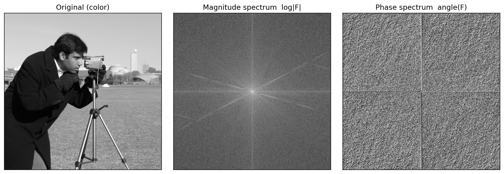
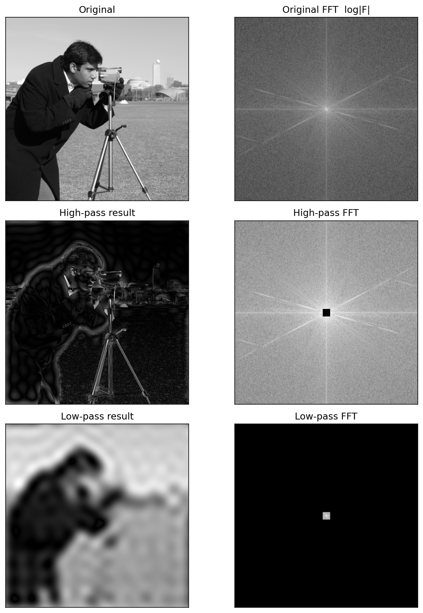
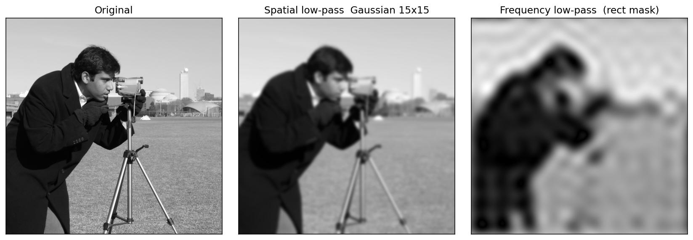
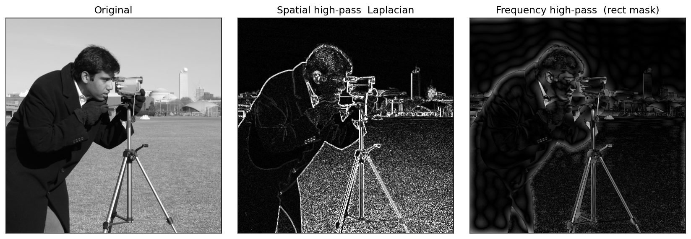
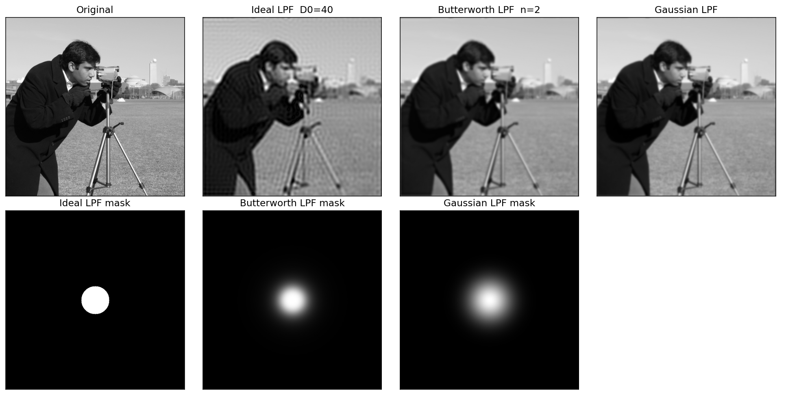
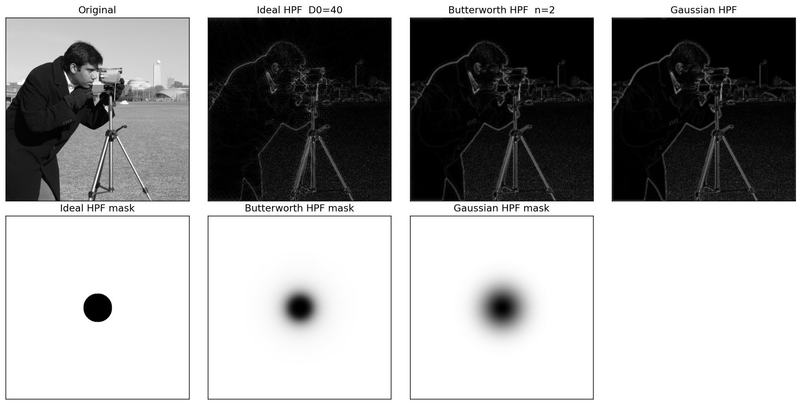
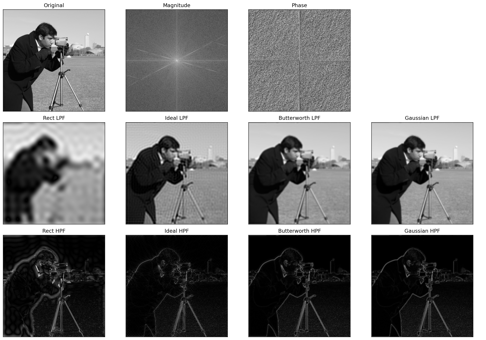

# 实 验 报 告

| 姓名 | 学号 | 专业 | 班级 |
| --- | --- | --- | --- |
| 雷正 | 202434610309 | 人工智能 | 24AI 3 班 |

**课程名称：** 图像处理与机器视觉

**实验名称：** 实验 3 — 频率域滤波

## 设计/实验项目名称

实验 3：频率域滤波（Frequency-Domain Filtering）。

## 基本内容描述

本实验围绕图像的二维离散傅里叶变换及其频率域滤波展开，主要内容如下：

1. 对单幅图像执行二维 FFT，并将零频分量平移到频谱中心，分别得到幅度谱与相位谱。
2. 参照矩形高通蒙版（中心置零、其余为 1），设计互补的矩形低通蒙版（中心置一、其余为 0），分别与中心化频谱相乘后做反变换，重构高通／低通滤波图像。
3. 将频率域滤波结果与同语义的空间域滤波（高斯模糊作低通、Laplacian 作高通）做主观与定量对比。
4. 选做：实现理想滤波器、Butterworth 滤波器、Gaussian 滤波器三类圆形频率响应蒙版，并比较其低通／高通效果。

本实验所用图像为 scikit-image 标准测试集中的 `data.camera()`（经典的 cameraman 灰度照片，分辨率 512×512，单通道）。该图像同时包含大面积平滑背景（天空、草地）、强边缘（摄影师轮廓、相机机身、三脚架腿）和密集细节（远处建筑、衣服纹理、相机镜头），覆盖了从低频到高频的完整频段，是最具代表性的 FFT 教学图。读取时通过 `cv2.IMREAD_COLOR` 统一为 3 通道 BGR，再 `cvtColor` 转为单通道灰度送入频域计算。

## 实验目的

1. 理解二维离散傅里叶变换的基本性质：幅度谱反映图像中各频率成分的能量，相位谱保留了边缘与结构的空间位置信息。
2. 掌握 `np.fft.fftshift` 将零频分量平移到频谱中心、`np.fft.ifftshift` 复原原位的作用。
3. 通过设计高通／低通蒙版并配合反变换，理解卷积定理：空间域的卷积 = 频率域的乘积，频率域滤波等价于一次特殊的空间域卷积。
4. 通过对比 Gaussian 模糊与频率域低通、Laplacian 与频率域高通，理解空间域滤波与频率域滤波在表达"低通"与"高通"概念时的等价性与差异。
5. 通过对比理想、Butterworth、Gaussian 三种频率响应，理解振铃效应（Gibbs Ringing）的产生原因以及"软"截止与"硬"截止的折衷关系。

## 实验环境与所用的库

本实验在以下软件环境下开发并运行：

```text
Python 3.13.11
opencv-python 4.13.0
matplotlib 3.10.8
numpy 2.4.2
scikit-image 0.26.0
```

主要使用的库及其功能如下：

- `numpy.fft`：`fft2`/`ifft2` 计算二维离散傅里叶变换及其逆变换；`fftshift`/`ifftshift` 移动零频分量。
- `cv2`：读取／写入图像、`cvtColor` 颜色空间转换、`GaussianBlur`、`Laplacian`、`convertScaleAbs`。
- `numpy`：构造布尔型蒙版、向量化生成距离网格用于圆形频率响应。
- `matplotlib`：多子图布局，将原图、幅度谱、相位谱、四种滤波结果统一保存为 PNG。
- `skimage.data`：提供 `astronaut()` 标准彩色测试图。
- `pathlib`：以脚本所在位置为锚定路径，避免依赖当前工作目录。

运行方式（在 `week3/` 目录下执行）：

```bash
python3 src/lab3_frequency_filtering.py
```

如使用自定义图片，可执行：

```bash
python3 src/lab3_frequency_filtering.py --input path/to/your_image.png
```

## 实验原理及程序实现

完整源程序见 `src/lab3_frequency_filtering.py`，关键部分摘录如下。

### 1. 二维傅里叶变换与频谱中心化

二维离散傅里叶变换将空间域图像 f(x, y) 映射为频率域复数张量 F(u, v)，定义为：

```text
F(u, v) = ΣΣ f(x, y) · exp(−j 2π (ux/M + vy/N))
```

直接得到的频谱将零频分量（直流项）放在四角，不便观察；通过 `np.fft.fftshift` 把零频平移到张量中心后，低频成分位于中心、高频成分位于四周，这正是后续设计高通／低通蒙版的几何前提。

```python
def fft_spectrum(gray):
    f = np.fft.fft2(gray.astype(np.float32))
    fshift = np.fft.fftshift(f)
    magnitude = np.log1p(np.abs(fshift))
    phase = np.angle(fshift)
    return fshift, magnitude, phase
```

幅度谱通常先做 `log(1+|F|)` 压缩动态范围，否则直流分量会比其它频率高几个量级，导致除中心点外几乎全黑无法观察。

### 2. 矩形高通与低通蒙版

PPT 中给出了矩形高通蒙版的实现：以频谱中心为基准，将边长为 2·half+1 的方形区域置 0、其余置 1，相当于阻断低频、放行高频：

```python
def rect_highpass_mask(shape, half=10):
    rows, cols = shape
    mid_r, mid_c = rows // 2, cols // 2
    mask = np.ones((rows, cols), dtype=np.float32)
    mask[mid_r - half : mid_r + half + 1, mid_c - half : mid_c + half + 1] = 0.0
    return mask
```

参照此模板，互补的低通蒙版只需把"0/1"语义对调——背景置 0、中心方块置 1，从而仅保留低频：

```python
def rect_lowpass_mask(shape, half=10):
    rows, cols = shape
    mid_r, mid_c = rows // 2, cols // 2
    mask = np.zeros((rows, cols), dtype=np.float32)
    mask[mid_r - half : mid_r + half + 1, mid_c - half : mid_c + half + 1] = 1.0
    return mask
```

两个蒙版严格满足 `lp_mask + hp_mask = 1`，即"低通通过的频率"与"高通通过的频率"互不重合且并集为全频谱，这正是互补滤波的几何含义。

### 3. 蒙版滤波与反变换

将中心化频谱与蒙版逐元素相乘，再依次 `ifftshift` 与 `ifft2` 即可获得重构图像。由于过滤后的频谱仍为复数张量，反变换结果在数值上也是复数，取其模长 `|·|` 作为最终的实值图像：

```python
def apply_mask(fshift, mask):
    masked = fshift * mask
    inv_shift = np.fft.ifftshift(masked)
    img = np.abs(np.fft.ifft2(inv_shift))
    return img, np.log1p(np.abs(masked))
```

### 4. 与空间域滤波的对比

为验证"频率域低通 = 空间域平滑"的卷积定理推论，本实验额外计算了 15×15、σ=3.0 的高斯模糊；为对比高通效果，则取 3×3 Laplacian 的绝对值：

```python
spatial_lp = cv2.GaussianBlur(gray, (15, 15), 3.0)
laplacian  = cv2.convertScaleAbs(cv2.Laplacian(gray, cv2.CV_32F, ksize=3))
```

### 5. 选做：理想／Butterworth／Gaussian 频率响应

构造圆形频率响应的关键是建立"每个像素到频谱中心的欧氏距离"网格 D(u, v)：

```python
def distance_grid(shape):
    rows, cols = shape
    u = np.arange(rows).reshape(-1, 1) - rows // 2
    v = np.arange(cols).reshape(1, -1) - cols // 2
    return np.sqrt(u * u + v * v).astype(np.float32)
```

在此距离网格上分别定义三种低通滤波器：

```text
理想低通       H_ideal(u, v)  = 1   if D(u, v) ≤ D0  else 0
Butterworth 低通 H_butter(u, v) = 1 / (1 + (D / D0)^(2n))
Gaussian   低通 H_gauss(u, v)  = exp(−D² / (2·D0²))
```

```python
def ideal_lowpass(shape, d0):
    return (distance_grid(shape) <= d0).astype(np.float32)

def butterworth_lowpass(shape, d0, n=2):
    d = distance_grid(shape)
    return (1.0 / (1.0 + (d / max(d0, 1e-6)) ** (2 * n))).astype(np.float32)

def gaussian_lowpass(shape, d0):
    d = distance_grid(shape)
    return np.exp(-(d ** 2) / (2.0 * d0 ** 2)).astype(np.float32)
```

由于"高通"等价于"放行频率 = 全频带 − 低通放行的频率"，对应的高通滤波器只需用 `1 − H_lowpass` 即可获得，无需另写公式。这与第 2 节中"高通／低通蒙版互补"的几何关系完全一致。

## 实验结果与分析

### 1. 输入图像与频谱

原始灰度输入图（cameraman 标准测试图）送入 FFT，输出幅度谱与相位谱：



观察可得：

- 幅度谱在中心附近能量最强，并呈现明显的水平／垂直亮线及一些斜向亮线——这正是 cameraman 图像中三脚架、相机镜头、地平线等大量横向／纵向／斜向边缘在频域上的能量集中。条纹中心的"亮斑"对应于图像整体平均亮度的直流项。
- 相位谱看似杂乱无章，但实际上它编码了图像中所有结构的位置信息。若把"幅度谱来自图 A、相位谱来自图 B"再反变换，会发现重构结果在视觉上更接近图 B，可见相位是真正承载"形状"的部分，幅度只反映"能量分布"。

### 2. 矩形蒙版的高通／低通滤波

以 half=10（即中央 21×21 区域为低频块）构造互补的矩形高通／低通蒙版，分别滤波后结果如下：



从视觉上：

- 低通结果只保留了图像中最低的若干个频率分量，整体呈现强烈的"块状模糊"，摄影师身躯、相机和三脚架的大致轮廓仍可辨认，但所有细节（远处建筑、镜头、衣服纹理）全部丢失；同时由于矩形蒙版的"硬截止"，图像四周出现了明显的振铃（Gibbs Ringing），表现为一组同心的明暗波纹。
- 高通结果只保留了高频分量，恰好与低通互补：图像呈现"灰色背景 + 强边缘"的浮雕效果，三脚架、相机机身轮廓、地平线、远处建筑边缘最为突出；天空与草地等大面积平滑区域因为缺乏高频成分而趋于均匀灰色。
- 右侧两个频谱图直观地展示了"蒙版相乘"是如何在频域上"剪掉"或"留下"中心方块的——低通频谱仅在中心 21×21 处有亮点，高通频谱则在该区域被完全置 0。

### 3. 空域低通 vs 频域低通

将矩形低通结果与同语义的 15×15、σ=3.0 高斯模糊并列对比：



二者都达到了"去除高频细节"的目的，但形态上存在差异：

- 空域高斯模糊衰减是连续平滑的，输出几乎不含可见的振铃，主观上"看起来仍像同一张图，只是失焦了"。
- 频域矩形低通的衰减是"硬截止"，超过截止频率的成分被完全归零，结果中可见的同心波纹正是该硬截止在空间域的等价响应（sinc 函数）。

这一对比直观印证了空间域和频率域的等价关系：要让频率域滤波"看起来像高斯模糊"，所用的频域响应也必须是平滑的——这正是 5.5 节中 Gaussian LPF 的设计动机。

### 4. 空域高通 vs 频域高通

对比 Laplacian（空域二阶差分）与矩形频域高通：



两种结果都强调了边缘，但能量分布有别：

- Laplacian 输出呈现细线状、稀疏的边缘响应，背景几乎全黑；这是因为 3×3 Laplacian 的频率响应在低频几乎为零、随频率单调增长，但对极高频也有响应，因此对噪声敏感。
- 频域矩形高通保留了从某个截止频率以上的全部能量，因而背景仍带有低对比的纹理（毛发、面罩反光、徽章），整体更"亮"。

可见，两种"高通"虽然语义相同，但实际的频率响应不一致，输出形态自然有别。这也是为什么实际工程中常用 Butterworth/Gaussian 频率响应代替简单的矩形截止。

### 5. 选做：理想／Butterworth／Gaussian 频率滤波

取 D0=40、Butterworth 阶数 n=2，三种圆形低通滤波器的蒙版与滤波结果：



对应的高通版本（蒙版取 1 − H_lowpass）：



主观上：

- 理想滤波器（圆形硬截止）的低通结果与矩形蒙版同样存在明显的振铃；高通结果则给出最锐利、细线状的边缘。
- Butterworth 滤波器在 n=2 时已经显著抑制了振铃，整体看起来更接近"自然的失焦"。
- Gaussian 滤波器是三者中过渡最平滑的，低通结果几乎不可见振铃；高通结果对应的边缘呈"软光晕"，主观上最柔和。

### 6. 各频域低通对空间高斯模糊的定量逼近

以 OpenCV 的 `cv2.GaussianBlur(15×15, σ=3.0)` 为参考，计算几种频域低通的均方误差（MSE）与峰值信噪比（PSNR）：

| 频域低通方案 | MSE | PSNR (dB) |
| --- | --- | --- |
| 矩形蒙版 (half=10) | 270.68 | 23.81 |
| 理想 LPF (D0=40) | 145.67 | 26.50 |
| Butterworth LPF (D0=40, n=2) | 26.26 | 33.94 |
| Gaussian LPF (D0=40) | 44.29 | 31.67 |

可以观察到：

1. 矩形蒙版与理想圆形低通的 PSNR 明显偏低（24–26 dB），这是它们共有的"硬截止 + 振铃"特征导致的；其中矩形蒙版的截止形状不是各向同性的圆形，与高斯响应差异更大。
2. Butterworth 与 Gaussian 频域低通由于响应连续平滑，PSNR 都大幅提升至 32–34 dB；二者与空域 Gaussian Blur 的差异在主观和客观上都已经难以区分——这与"高斯函数的傅里叶变换还是高斯函数"的数学事实完全吻合。

### 7. 全部结果汇总

为便于一次性查看主要结果，将原图、幅度谱、相位谱、矩形／理想／Butterworth／Gaussian 四套低通／高通滤波结果集中显示：



本次程序共生成以下结果文件：

```text
data/outputs/01_original_color.png
data/outputs/02_original_gray.png
data/outputs/10_magnitude_spectrum.png
data/outputs/11_phase_spectrum.png
data/outputs/12_amp_phase_compare.png
data/outputs/20_mask_highpass_rect.png
data/outputs/21_mask_lowpass_rect.png
data/outputs/22_rect_highpass_img.png
data/outputs/23_rect_lowpass_img.png
data/outputs/24_rect_filtering_compare.png
data/outputs/30_spatial_vs_freq_lowpass.png
data/outputs/31_spatial_vs_freq_highpass.png
data/outputs/40_ideal_lpf.png       ... 42_gauss_lpf.png
data/outputs/43_ideal_hpf.png       ... 45_gauss_hpf.png
data/outputs/50_freq_filter_compare_lpf.png
data/outputs/51_freq_filter_compare_hpf.png
data/outputs/70_all_results.png
data/outputs/metrics.txt
```

## 结论

### 1. 实验中的做法

本次实验依次完成了二维 FFT 的幅度谱与相位谱观察、矩形高通／低通蒙版的设计与反变换重构、空间域与频率域滤波的对比、以及理想／Butterworth／Gaussian 三类圆形频率响应的实现与定量评价。具体做法是：先将灰度 `camera()` 标准 cameraman 图送入 `np.fft.fft2`，并用 `fftshift` 将零频平移到张量中心；以中心方块大小 half=10 构造一组互补的矩形蒙版（高通中心 0、低通中心 1），将各自与中心化频谱相乘后反变换得到重构图像；再分别用 `cv2.GaussianBlur` 与 `cv2.Laplacian` 计算同语义的空域低通、空域高通结果作为对照；最后以 `D0=40` 的距离阈值实现理想、Butterworth (n=2)、Gaussian 三类圆形低通，并以 `1 − H` 直接生成对应高通。所有结果由 Matplotlib 保存为多子图 PNG，关键数值差异由 MSE/PSNR 记录在 `metrics.txt`。

### 2. 遇到的困难及解决方法

实验过程中遇到的主要困难有三个：

1. 幅度谱直接显示几乎全黑。原始幅度谱中的直流分量比其它频率高数个量级，线性显示会把所有非中心像素压成同一灰度。解决方法是采用 `log(1 + |F|)` 压缩动态范围，使中高频细节也能在图像中清晰可见。
2. 反变换结果出现复数残差。`np.fft.ifft2` 即便输入完美对称也可能因为浮点误差产生微小虚部，直接 `.real` 会带噪点。解决方法是对反变换结果取模长 `np.abs(·)`，再统一线性归一化到 [0, 255] 后保存。
3. 矩形与理想低通输出的振铃。最初我以为矩形蒙版的低通效果会与高斯模糊近似，但实际输出带有明显同心波纹。查阅资料后理解到这是 sinc 函数在空间域的等价响应，属于"硬截止"导致的 Gibbs 现象。这一发现也是引入 Butterworth 与 Gaussian 频域滤波作为对照的直接动机。

### 3. 收获与体会

本次实验让我从"频率"这一维度重新理解了图像处理：图像可以看作不同频率正弦波的叠加，低频对应大尺度的亮度走势、高频对应边缘与细节；任何空间域的卷积都可以在频域上等价地写成"一次乘法"，反之亦然——这正是卷积定理在工程中的真正价值。在具体实现层面，我学会了 `fft2/ifft2` 与 `fftshift/ifftshift` 的配套用法，理解到幅度谱只反映各频率的能量大小，而相位谱才是承载"形状信息"的关键。设计高通／低通蒙版的过程让我体会到，频率域滤波几乎就是在频谱图上"用橡皮擦擦出几何形状"，简洁、直观，且能够轻易实现空间域上难以表达的特殊响应（如带阻、陷波）。最后，对理想／Butterworth／Gaussian 三种频率响应的对比让我直观看到了"硬截止 vs 软截止"的折衷：硬截止能彻底剔除某段频率，但代价是振铃；软截止虽然不能"绝对清零"任何频率，但在主观和客观上都更接近自然平滑。综合来看，Gaussian 频域滤波在 PSNR 上能逼近 31 dB 的水平复现空域 Gaussian Blur，这是本次实验中最直观、最有说服力的卷积定理验证。
