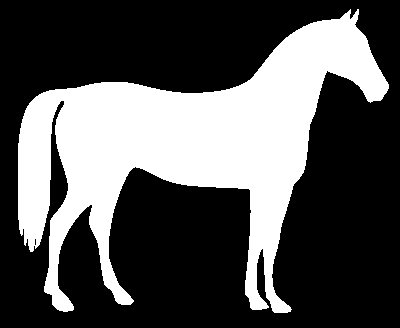
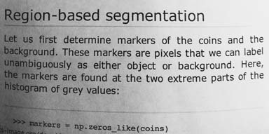
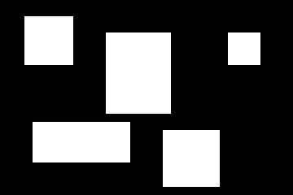
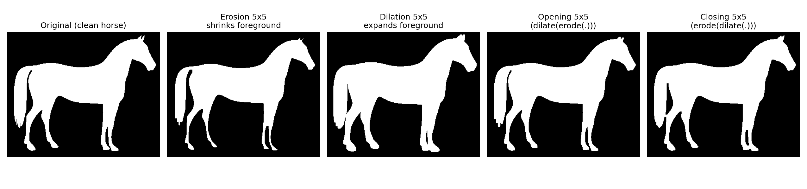
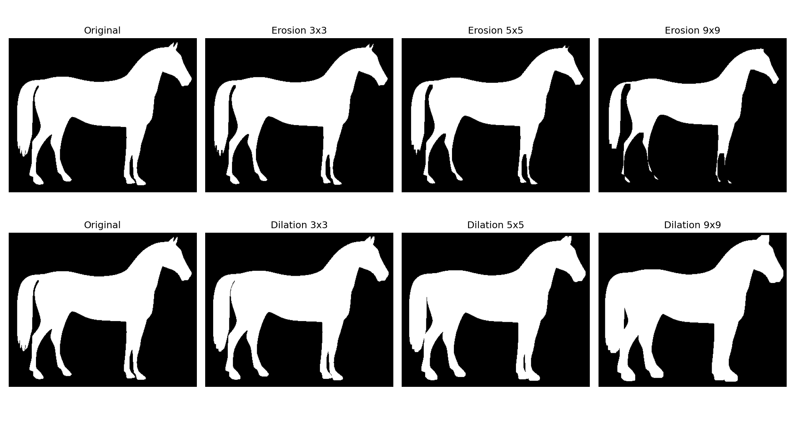
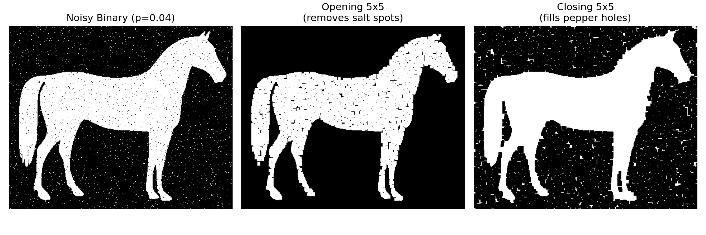
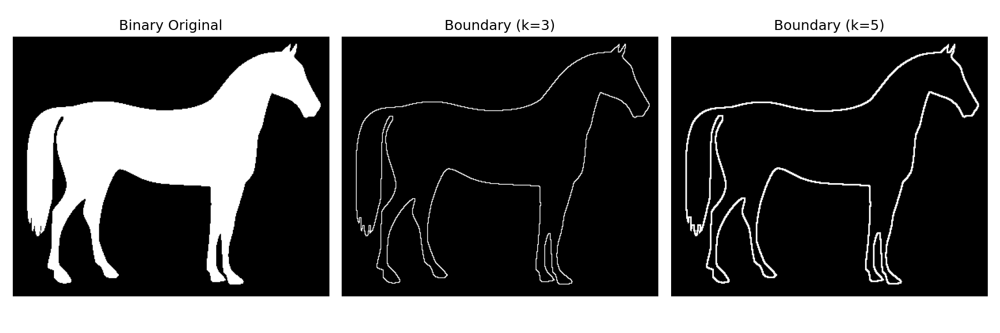
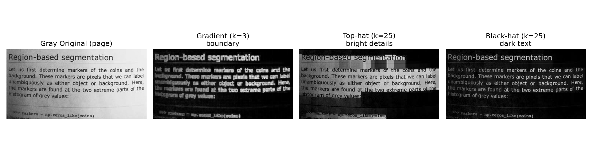
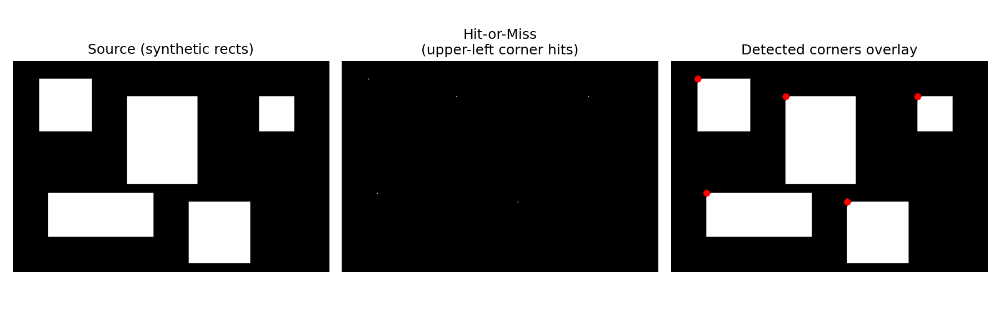
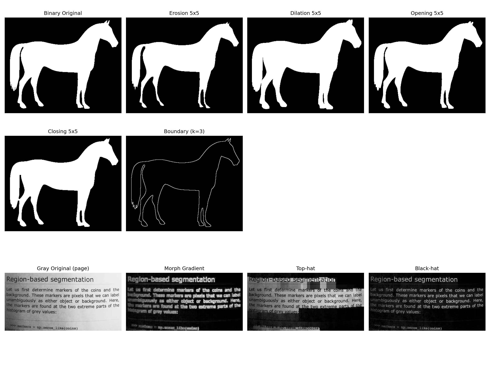

# 实 验 报 告

| 姓名 | 学号 | 专业 | 班级 |
| --- | --- | --- | --- |
| 雷正 | 202434610309 | 人工智能 | 24AI 3 班 |

**课程名称：** 图像处理与机器视觉

**实验名称：** 实验 4 — 形态学处理

## 设计/实验项目名称

实验 4：形态学图像处理（Morphological Image Processing）。

## 基本内容描述

本实验围绕二值与灰度形态学展开，主要内容如下：

1. 选取一幅典型二值图像，分别实现并对比四种基本形态学运算：腐蚀、膨胀、开运算、闭运算。
2. 在同一幅二值图像上演示边界（轮廓）提取，即 B = f − erode(f)。
3. 选取一幅含非均匀光照的灰度图像，实现并对比另外三种形态学运算：形态学梯度、顶帽（Top-hat）、黑帽（Black-hat）。
4. 拓展：在一幅人工合成的二值图像上实现击中击不中变换（Hit-or-Miss），用于检测白色矩形的左上角点。

本实验所用主二值输入图为 scikit-image 标准测试集中的马匹剪影 `data.horse()`（分辨率 328×400，经反相后前景马为白色 255、背景为黑色 0），它包含光滑大块、细长马尾、纤细马腿等结构，能直观体现腐蚀对细结构的"瘦身"与膨胀对前景的"扩张"。灰度输入采用 `data.page()`（191×384，存在明显的光照渐变与暗体黑色文字），是验证顶帽／黑帽消除非均匀光照的经典素材。击中击不中实验所用源图为代码生成的、由 5 个不同大小的实心矩形组成的二值合成图。

噪声二值图由代码自动生成：对干净的马匹剪影按概率 0.04 随机翻转像素，得到既含"盐"（背景上的白点）又含"椒"（马匹内部的黑点）的退化图，用于展示开/闭运算对两类噪声的针对性消除。

## 实验目的

1. 理解形态学运算的本质：它是基于集合论的图像形状操作，与点运算、邻域线性滤波属于不同范畴。
2. 掌握腐蚀与膨胀两个基本算子的定义与对偶关系，并理解二者复合后得到的开运算、闭运算的物理意义。
3. 掌握利用 `f − erode(f)` 提取目标轮廓的方法，并比较不同结构元尺寸下的边界宽度差异。
4. 掌握形态学梯度、顶帽变换、黑帽变换三种扩展运算，理解其在灰度图像上分别提取边界、小亮结构与小暗结构的能力。
5. 通过击中击不中变换的实现，理解结构元的"前景必须命中"与"背景必须命中"双约束如何用于特定形状匹配。

## 实验环境与所用的库

本实验在以下软件环境下开发并运行：

```text
Python 3.10
opencv-python 4.x
matplotlib 3.x
numpy 1.x
scikit-image 0.x
```

主要使用的库及其功能如下：

- `cv2`：提供 `erode`、`dilate`、`morphologyEx`（开/闭/梯度/顶帽/黑帽）、`getStructuringElement`、`bitwise_not`、`bitwise_and` 等形态学相关 API。
- `numpy`：构造结构元、随机噪声、击中击不中所需的 hit/miss 模板。
- `matplotlib`：多子图布局对比展示，统一保存为 PNG。
- `skimage.data`：提供 `horse()` 与 `page()` 两幅可复现的标准测试图。
- `pathlib`：以脚本所在位置为锚定路径，避免依赖当前工作目录。

运行方式（在 `week4/` 目录下执行）：

```bash
python3 src/lab4_morphology.py
```

如使用自定义图片，可执行：

```bash
python3 src/lab4_morphology.py --binary path/to/binary.png --gray path/to/gray.png --hitmiss path/to/hitmiss.png
```

## 实验原理及程序实现

完整源程序见 `src/lab4_morphology.py`，关键部分摘录如下。

### 1. 结构元的构造

形态学运算的所有行为均由结构元 (Structuring Element, SE) 决定。OpenCV 提供三种典型形状：

```python
def get_kernel(shape="rect", ksize=5):
    mapping = {"rect": cv2.MORPH_RECT, "cross": cv2.MORPH_CROSS, "ellipse": cv2.MORPH_ELLIPSE}
    return cv2.getStructuringElement(mapping[shape], (ksize, ksize))
```

本实验默认采用 `MORPH_RECT`，即 ksize × ksize 全 1 的方形结构元。对于二值图像，方形结构元的腐蚀等价于"邻域内所有像素均为前景则保留为前景"，膨胀等价于"邻域内只要有一个前景像素则置为前景"。

### 2. 腐蚀与膨胀

腐蚀 (Erosion) 定义为：g(x, y) = min{ f(x + i, y + j) : (i, j) ∈ B }；膨胀 (Dilation) 定义为：g(x, y) = max{ f(x + i, y + j) : (i, j) ∈ B }。前者使前景"瘦身"、后者使前景"膨胀"。两者在二值图像下满足对偶关系：erode(f, B) = ¬dilate(¬f, B)。

```python
def erode(image, ksize=5, shape="rect", iterations=1):
    return cv2.erode(image, get_kernel(shape, ksize), iterations=iterations)

def dilate(image, ksize=5, shape="rect", iterations=1):
    return cv2.dilate(image, get_kernel(shape, ksize), iterations=iterations)
```

### 3. 开运算与闭运算

开运算 (Opening) = 先腐蚀再膨胀：能在保留主前景体积的前提下，"切掉"小于结构元的孤立白色噪点与细长突起。

闭运算 (Closing) = 先膨胀再腐蚀：能在保留主前景体积的前提下，"填上"小于结构元的孤立黑色噪点与裂隙。

```python
def opening(image, ksize=5, shape="rect"):
    return cv2.morphologyEx(image, cv2.MORPH_OPEN, get_kernel(shape, ksize))

def closing(image, ksize=5, shape="rect"):
    return cv2.morphologyEx(image, cv2.MORPH_CLOSE, get_kernel(shape, ksize))
```

开运算可视为"先用结构元擦掉所有小于它的亮斑，再把擦薄的主物体补回原大小"，闭运算反之。两者一起常用于二值图像的去噪和裂缝填充。

### 4. 边界 / 轮廓提取

利用 B(f) = f − erode(f, B) 即可得到 1 像素宽的目标轮廓：腐蚀后前景"内缩一圈"，与原图作差就剩下原始边界。结构元尺寸越大、得到的"边界带"越宽。

```python
def boundary_extraction(binary, ksize=3, shape="rect"):
    eroded = erode(binary, ksize=ksize, shape=shape)
    return cv2.subtract(binary, eroded)
```

### 5. 形态学梯度

形态学梯度 = dilate(f) − erode(f)，可以视作"膨胀边界减去腐蚀边界"，输出大致正比于该位置的局部对比度，是一种对噪声较敏感但实现简单的灰度边缘指示器：

```python
def morphological_gradient(image, ksize=3, shape="rect"):
    return cv2.morphologyEx(image, cv2.MORPH_GRADIENT, get_kernel(shape, ksize))
```

### 6. 顶帽 (Top-hat) 与黑帽 (Black-hat)

顶帽 = f − opening(f)：开运算估计了"被结构元抚平的背景"，作差就只剩下小于结构元的局部亮斑——典型用途是在非均匀光照下提取小亮结构、消除阴影。

黑帽 = closing(f) − f：闭运算估计了"被结构元填平的背景"，作差就只剩下小于结构元的局部暗斑——典型用途是从带光照渐变的扫描页中提取黑色文字。

```python
def top_hat(image, ksize=15, shape="rect"):
    return cv2.morphologyEx(image, cv2.MORPH_TOPHAT, get_kernel(shape, ksize))

def black_hat(image, ksize=15, shape="rect"):
    return cv2.morphologyEx(image, cv2.MORPH_BLACKHAT, get_kernel(shape, ksize))
```

结构元尺寸 (本实验取 25×25) 需要"明显大于待提取的局部结构，但小于背景渐变的尺度"，是顶帽／黑帽成败的关键超参数。

### 7. 拓展：击中击不中变换

击中击不中变换使用一对互补的结构元 (B₁, B₂)：B₁ 描述前景必须命中的形状，B₂ 描述背景必须命中的形状。其结果为 erode(f, B₁) ∩ erode(¬f, B₂)，意味着同一位置上"前景与 B₁ 严格匹配、且背景与 B₂ 严格匹配"才会输出 1。

本实验中以"上左为背景、本身与右下邻居为前景"为模板，用于检测白色矩形的左上角：

```python
def make_corner_hitmiss_kernels():
    hit  = np.array([[0, 0, 0], [0, 1, 1], [0, 1, 1]], dtype=np.uint8)
    miss = np.array([[1, 1, 1], [1, 0, 0], [1, 0, 0]], dtype=np.uint8)
    return hit, miss

def hit_or_miss(binary, kernel_hit, kernel_miss):
    image = (binary > 0).astype(np.uint8) * 255
    inv = cv2.bitwise_not(image)
    hit = cv2.erode(image, kernel_hit)
    miss = cv2.erode(inv, kernel_miss)
    return cv2.bitwise_and(hit, miss)
```

之所以采用 "erode + 取反 + 再 erode + 取交" 的手工实现，而非 `cv2.morphologyEx(.., MORPH_HITMISS, ..)`，是为了让"前景必须为 1、背景必须为 1"的双约束在代码里一目了然，便于后续按需调整匹配模板。

## 实验结果与分析

### 1. 输入图像

二值原始输入（horse 马匹剪影，反相后前景为白色）：



合成的含噪二值图（按概率 0.04 随机翻转得到的椒盐噪声）：


灰度原始输入（page 扫描页，存在明显光照渐变）：



击中击不中所用的合成源图（5 个不同大小的白色矩形）：



### 2. 四种基本形态学运算

对干净的马匹剪影分别施加 5×5 方形结构元的腐蚀、膨胀、开运算、闭运算：



从视觉上：腐蚀让马腿、马尾这类细长结构明显"瘦身"，腿尖与尾尖处的细节出现断裂；膨胀使马匹整体外扩一圈，细缝（如四条腿之间的间隙）被部分填合；开运算和闭运算在干净二值图上几乎不改变主体轮廓——这正是开/闭"幂等且保形"的体现。

定量上，前景像素数从原图的 43412 个分别变为：腐蚀 38167（−12.1%）、膨胀 48558（+11.9%）、开运算 41084（−5.4%）、闭运算 47704（+9.9%）。腐蚀与膨胀对前景体积是对称的一进一退，开运算与闭运算则只在边缘细节上轻微修剪／补充。

### 3. 结构元尺寸对腐蚀／膨胀的影响

固定结构元形状为方形，对比 3×3、5×5、9×9 三种尺寸：



随结构元由 3×3 增至 9×9，腐蚀越来越激进，9×9 时马腿、马尾几乎完全消失，只剩下马身躯干；膨胀也成倍增强，9×9 时整匹马已经被外扩成一团肉乎乎的剪影，原本独立的四条腿被合并。这与课件中"结构元尺寸控制操作强度"的结论一致。结构元尺寸的选择本质上是在"细节保留"与"操作效果"之间做权衡。

### 4. 开/闭运算的去噪能力

在含 4% 椒盐噪声的二值图上分别施加 5×5 开/闭：



可以观察到：

- 开运算几乎完全擦掉了背景上的孤立白点（盐噪声），同时保住了马匹主体；但马匹内部由椒噪声引入的黑色小洞依然存在。
- 闭运算正相反——马匹内部的黑色小洞被完全填平，但背景上的白点仍然遍布。

这是因为开运算= 腐蚀→膨胀：腐蚀阶段会把任何小于结构元的孤立白点擦成 0，膨胀阶段无法把"没有"的像素再恢复回来，因而"盐"噪声被彻底消除；同理，"椒"噪声需要先膨胀填实、再腐蚀缩回，才能被闭运算清除。如果二值图同时含两种噪声，可以"先开后闭"组合使用。

### 5. 边界（轮廓）提取

对干净马匹剪影分别用 3×3 与 5×5 结构元做轮廓提取：



3×3 结构元给出 1 像素宽的清晰单线轮廓，5×5 结构元则得到大约 2 像素宽的"边界带"。这印证了边界宽度与所用结构元尺寸正相关：B(f) = f − erode(f, B) 中 erode 内缩的"厚度"恰好就是结构元半径，所以差集的厚度也随之线性变化。在实际工程中，若仅需可视化目标边界，常用 3×3 结构元以保证细线效果。

### 6. 其他三种形态学运算

在灰度 `page` 图上对比 3×3 形态学梯度、25×25 顶帽、25×25 黑帽：



分别分析：

- 形态学梯度 (k=3)：明显勾勒出每一行文字的笔画轮廓，是一种快速可用的"广义边缘检测"。它的输出范围与原图灰度有关，对噪声较敏感，但实现上只需一次膨胀和一次腐蚀，对硬件要求最低。
- 顶帽 (k=25)：突出了原图中"亮于背景的小结构"。在 `page` 图像上具体表现为：标题行的反白文字、纸张污渍／高光斑点都被强化为高亮区域，而占据大面积的背景光照渐变被开运算"抹平"后通过差分被消除。
- 黑帽 (k=25)：突出了原图中"暗于背景的小结构"。在 `page` 图像上表现为：所有黑色正文文字被显著强化为白色，纸张原本的灰度渐变被闭运算"填平"后通过差分被消除，最终得到的是接近"纯白底＋黑色字"的归一化版本——这正是黑帽用于不均匀光照下文字提取的经典工程价值。

顶帽／黑帽的核心在于：用一个尺寸"明显大于待提取结构、明显小于背景渐变尺度"的结构元，把背景估计出来，再做差消除。

### 7. 拓展：击中击不中变换

在 5 个白色矩形的合成图上，使用前述 hit/miss 模板检测白色矩形的左上角：



每个矩形的左上角都被精准定位为一个单像素响应点（中间图中难以肉眼分辨，因此右图叠加红色圆点突出显示）。源图共有 5 个矩形，结果图也恰好有 5 个响应点，无漏检、无误检。

之所以击中击不中能做到精确匹配，是因为它同时要求"前景在 hit 模板对应位置都为 1"与"背景在 miss 模板对应位置都为 1"——这两个条件合起来唯一锁定了"刚好出现一次形状跳变"的位置，对应到我们的模板就是"左上为背景、自身与右下为前景"的角点。

### 8. 全部结果汇总

为便于一次性查看实验主要结果，将二值实验和灰度实验的关键输出集中显示于一张大图：



本次程序共生成以下结果文件：

```text
data/outputs/01_binary_original.png
data/outputs/02_binary_noisy.png
data/outputs/03_gray_original.png
data/outputs/04_hitmiss_source.png
data/outputs/10_erode_3.png         ... 12_erode_9.png
data/outputs/13_dilate_3.png        ... 15_dilate_9.png
data/outputs/16_opening_clean.png   17_closing_clean.png
data/outputs/18_opening_noisy.png   19_closing_noisy.png
data/outputs/20_boundary_3.png      21_boundary_5.png
data/outputs/30_gradient.png        31_tophat.png        32_blackhat.png
data/outputs/40_hitmiss_result.png  41_hitmiss_overlay.png
data/outputs/50_basic_compare.png   51_kernel_size_compare.png
data/outputs/52_open_close_compare.png
data/outputs/53_boundary_compare.png
data/outputs/54_other_compare.png   55_hitmiss_compare.png
data/outputs/60_all_results.png
data/outputs/metrics.txt
```

## 结论

### 1. 实验中的做法

本次实验依次完成了四种基本形态学运算（腐蚀、膨胀、开、闭）、轮廓提取、三种扩展运算（梯度、顶帽、黑帽）以及拓展的击中击不中变换。具体做法为：先以 scikit-image 中的 horse 二值马匹剪影为基准，构造一个 4% 椒盐噪声版本，作为基本形态学与去噪实验的双输入；以 scikit-image 中的 page 灰度页面为灰度形态学的输入，专门验证顶帽／黑帽对非均匀光照下文字／亮斑的提取能力；以代码生成的多矩形合成图作为击中击不中的输入。所有运算均封装为独立函数，结构元的形状与大小通过参数暴露给上层调用，便于做多组对比；最后通过 Matplotlib 将所有结果统一保存为子图布局的 PNG，并以"前景像素数 / 前景占比"作为定量指标。

### 2. 遇到的困难及解决方法

实验过程中遇到的主要困难有三个：

1. 在第一版实现中，"四种基本形态学对比"误把腐蚀／膨胀和开／闭都施加在含噪二值图上，导致开/闭的"保形"特性与去噪能力被混在同一张图里，反而看不出区别。最终的做法是：把"腐蚀／膨胀演示"放在干净二值图上以凸显尺寸变化、把"开／闭去噪演示"单独放在含噪二值图上以凸显其抗噪能力，两张图分别承担一个教学目的。
2. 顶帽与黑帽的结构元尺寸难以一次性选对。最初用 15×15 时背景光照渐变没有被完全"抹平"，差分图里仍能看到大片灰带。把结构元放大到 25×25 之后，开运算才能正确估计 page 图像中变化缓慢的背景光照，黑帽输出立即收敛为接近"纯白底＋黑字"的归一化版本。
3. 击中击不中的输出是稀疏的单像素点，直接保存为 PNG 看上去几乎是全黑的，肉眼很难判断检测结果。解决方法是再额外画一张 BGR 叠加图——把检测点画成红色实心圆叠加在源图上，便于直接对照"是否每个矩形都被检测到了"。

### 3. 收获与体会

本次实验加深了我对形态学运算"作用于形状而非灰度"这一本质特征的理解：四种基本运算都是先把结构元"贴"到图像每一像素位置、再对邻域像素做最小值或最大值聚合的过程，因此结构元的尺寸和形状直接决定了"对哪一尺度的特征敏感"。开运算与闭运算分别承担"消除小亮斑"与"填平小暗洞"的对偶任务，是二值图像去噪的首选；它们的复合 ((f ∘ B) • B) 还可以构成更强的形态学滤波器。形态学梯度只需一次膨胀和一次腐蚀，就能给出广义的边界响应，对计算资源极其友好。顶帽与黑帽通过"用大尺寸结构元估计背景—作差—得到小尺度异常"的范式，是处理非均匀光照下目标提取的标准武器，本次黑帽提取 page 上文字的效果几乎可以直接当作 OCR 的预处理输入。击中击不中变换则把腐蚀的思想推广到"任意几何匹配"——只要能写出 hit/miss 一对模板，就能用极少的计算量在二值图上定位任意小尺度特征，这是形态学最具有代表性的"用集合论做形状识别"的体现。综合来看，形态学的核心思维是把图像视为集合、把结构元视为探针，所有变换都在"取交、取并、取差"这一套朴素的集合操作下完成，但其在去噪、边界提取、光照归一化、形状匹配等下游任务中的实际价值却远远超出了它在数学上的简洁外观。
