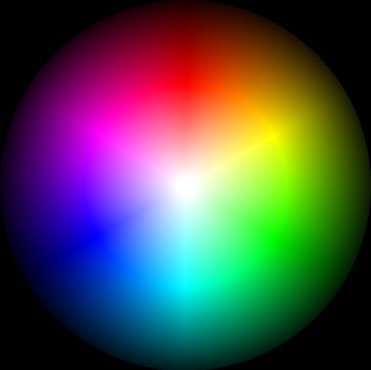
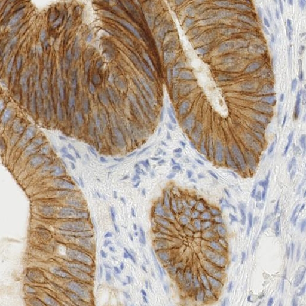
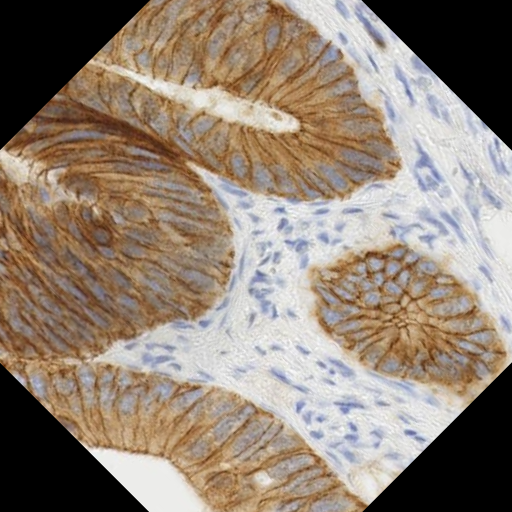
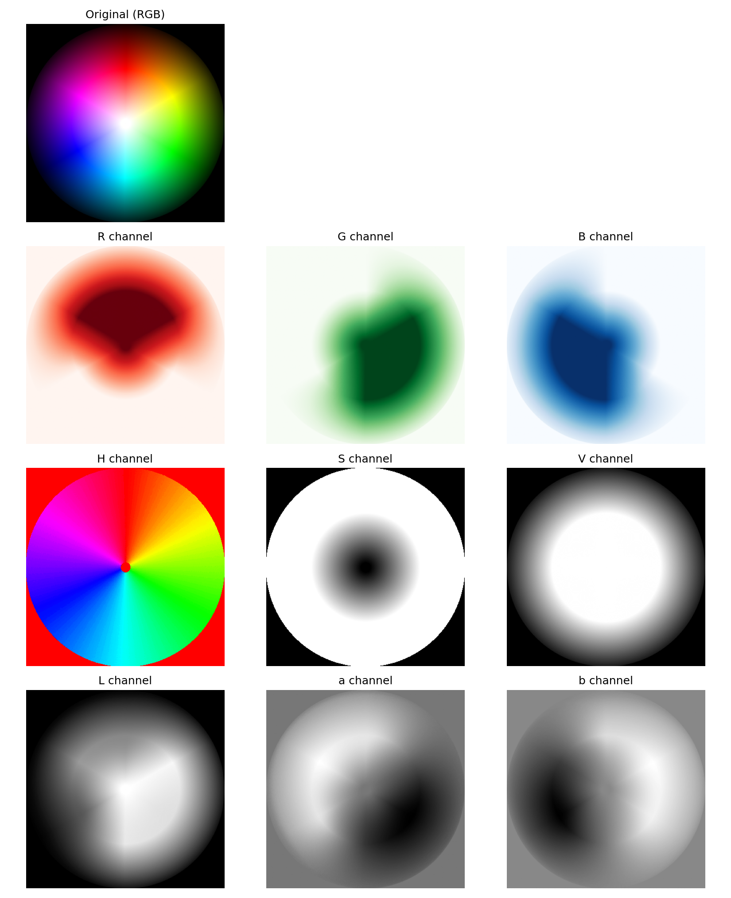
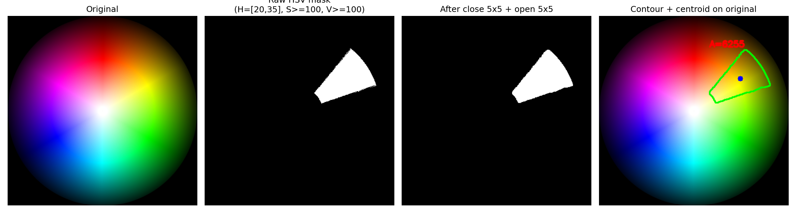
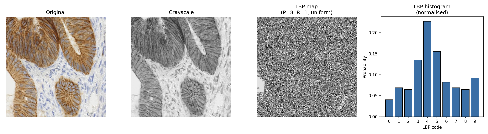
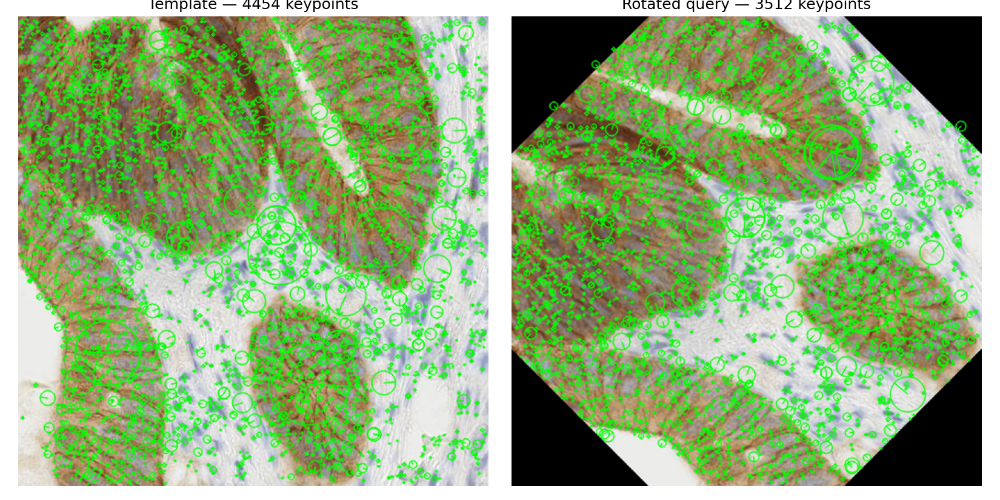
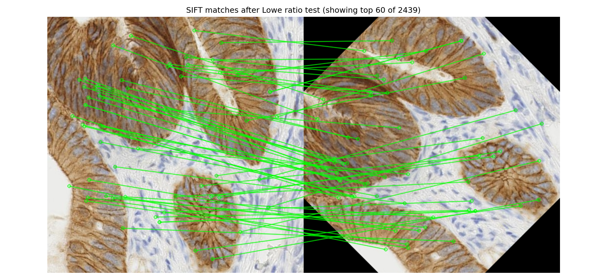
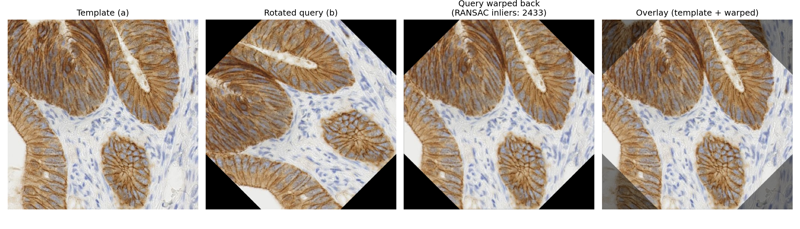
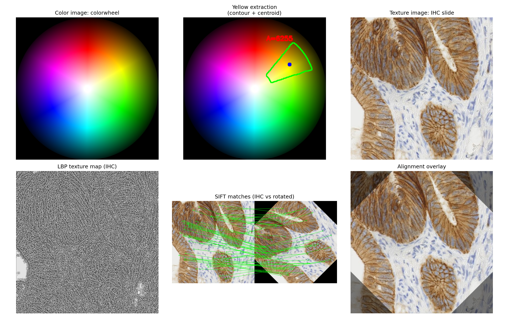

# 实 验 报 告

| 姓名 | 学号 | 专业 | 班级 |
| --- | --- | --- | --- |
| 雷正 | 202434610309 | 人工智能 | 24AI 3 班 |

**课程名称：** 图像处理与机器视觉

**实验名称：** 实验 5 — 图像特征提取

## 设计/实验项目名称

实验 5：图像特征提取（Image Feature Extraction）——颜色特征、纹理特征与形状特征。

## 基本内容描述

本实验围绕颜色、纹理、形状三种最常用的图像特征展开，依次完成四项子实验：

1. 颜色空间分解：将一幅彩色图像由 RGB 模型分别转换到 HSV、Lab 模型，并将 9 个通道全部分离显示。
2. 颜色特征提取：基于 HSV 色相阈值与形态学去噪，在彩色图上提取出黄色区域，并通过轮廓与图像矩计算重心与面积。
3. 纹理特征提取：对一幅含丰富纹理的图像计算 P=8、R=1 的均匀模式 LBP（Uniform Local Binary Pattern），输出 LBP 响应图与归一化直方图。
4. 形状特征提取：使用 SIFT（Scale-Invariant Feature Transform）算子检测原图与旋转 45° 版本的关键点和 128 维描述符，通过 FLANN K 近邻匹配与 Lowe 比率测试筛选可靠匹配对，再用 RANSAC 估计单应性矩阵把旋转后的查询图对齐回原图。

颜色实验所用的输入为 scikit-image 标准数据集中的 `colorwheel`（370×371，包含 360° 色相的彩色色环），它把整个 HSV 空间在一幅图中可视化，是验证通道分解与色相阈值化的最佳素材；纹理与形状实验所用的输入为 `immunohistochemistry`（512×512，免疫组织化学染色切片），DAB 棕黄色染色与紫蓝色苏木精复染叠加，既保证了 LBP 所需的密集局部灰度跳变，也提供了大量 SIFT 关键点。两幅输入图覆盖了"理想合成"与"真实场景"两类，便于和理论描述对照。

旋转查询图由代码自动合成：以原图中心为旋转中心、按 cv2.getRotationMatrix2D 构造 45° 旋转矩阵，对纹理图做一次 warpAffine，用以模拟实际场景中相机视角变化或目标自身旋转的情况。

## 实验目的

1. 理解颜色空间转换的本质：RGB 是设备相关的三原色发光模型，HSV 把色相、饱和度、亮度解耦，Lab 是设备无关的感知均匀空间，三者各自适合不同的任务。
2. 掌握利用 HSV 色相 + 饱和度 + 亮度三段阈值化提取特定颜色目标的工程范式：阈值化生成掩膜，形态学去除毛刺，轮廓与图像矩给出位置与尺寸描述。
3. 掌握 LBP 算子的定义、均匀模式 (uniform) 降维原理以及 LBP 直方图作为纹理特征向量的物理意义。
4. 掌握 SIFT 算法尺度不变、旋转不变、对光照变化鲁棒的核心思想，并通过 FLANN 匹配 + Lowe 比率测试 + RANSAC 单应性估计的完整流水线，验证特征点在 45° 旋转变换下的可对齐性。

## 实验环境与所用的库

本实验在以下软件环境下开发并运行：

```text
Python 3.10
opencv-python 4.x (含 SIFT 模块)
matplotlib 3.x
numpy 1.x
scikit-image 0.x (LBP, 测试图像)
```

主要使用的库及其功能如下：

- `cv2`：颜色空间转换 (`cvtColor`)、HSV 阈值化 (`inRange`)、形态学运算 (`morphologyEx`)、轮廓与矩 (`findContours`、`moments`)、仿射变换 (`getRotationMatrix2D`、`warpAffine`)、SIFT 算子 (`SIFT_create`)、FLANN 匹配器 (`FlannBasedMatcher`)、单应性估计 (`findHomography`)、绘制关键点与匹配对 (`drawKeypoints`、`drawMatches`)。
- `skimage.feature`：提供 `local_binary_pattern`，包含 default、ror、uniform、nri_uniform、var 等多种 LBP 变体。
- `skimage.data`：提供 `colorwheel()` 与 `immunohistochemistry()` 两幅可复现的标准测试图。
- `numpy`：构造阈值上下界数组、统计 LBP 直方图、向量化运算。
- `matplotlib`：多子图布局对比展示，统一保存为 PNG。
- `pathlib`：以脚本所在位置为锚定路径，避免依赖当前工作目录。

运行方式（在 `week5/` 目录下执行）：

```bash
python3 src/lab5_feature_extraction.py
```

如需替换输入图像或调整黄色色相区间：

```bash
python3 src/lab5_feature_extraction.py \
    --color path/to/color.png \
    --texture path/to/texture.png \
    --h-min 15 --h-max 35 --rotate-angle 30
```

## 实验原理及程序实现

完整源程序见 `src/lab5_feature_extraction.py`，关键部分摘录如下。

### 1. 颜色空间转换与通道分离

OpenCV 默认按 BGR 顺序存储彩色图像，转换到其他色彩空间只需一次 `cvtColor`：

```python
def split_color_spaces(bgr):
    rgb = cv2.cvtColor(bgr, cv2.COLOR_BGR2RGB)
    hsv = cv2.cvtColor(bgr, cv2.COLOR_BGR2HSV)
    lab = cv2.cvtColor(bgr, cv2.COLOR_BGR2Lab)
    r, g, b = cv2.split(rgb)
    h, s, v = cv2.split(hsv)
    L, a, bl = cv2.split(lab)
    return {"R": r, "G": g, "B": b, "H": h, "S": s, "V": v, "L": L, "a": a, "b": bl}
```

三种色彩空间的取值约定如下：

- RGB：三个通道均取 [0, 255]，分别记录红、绿、蓝原色的强度。
- HSV：H ∈ [0, 180]（OpenCV 将 [0°, 360°] 折半以塞进 uint8），代表色相；S ∈ [0, 255]，代表饱和度；V ∈ [0, 255]，代表亮度。色相与亮度解耦是这套表示的关键优势。
- Lab：L ∈ [0, 255] 是与人眼亮度感知近似线性的明度通道；a 通道描述红绿对立轴；b 通道描述黄蓝对立轴。Lab 在欧氏距离意义下近似感知均匀，常用于颜色比较与色差度量。

### 2. 黄色目标提取

OpenCV 中黄色的色相约位于 H ∈ [20, 35]，再叠加 S ≥ 100、V ≥ 100 的饱和与亮度下限，可以同时排除暗黄、灰黄和接近白色的浅黄。掩膜生成后，先做 5×5 闭运算填补"小洞"，再做 5×5 开运算消除"小白点"，最后用 `findContours` 提取轮廓并通过图像矩计算质心：

```python
def extract_yellow(bgr, h_min=20, h_max=35, s_min=100, v_min=100,
                   morph_ksize=5, min_area=100):
    hsv = cv2.cvtColor(bgr, cv2.COLOR_BGR2HSV)
    lower = np.array([h_min, s_min, v_min], dtype=np.uint8)
    upper = np.array([h_max, 255, 255], dtype=np.uint8)
    raw_mask = cv2.inRange(hsv, lower, upper)

    kernel = cv2.getStructuringElement(cv2.MORPH_RECT, (morph_ksize, morph_ksize))
    mask = cv2.morphologyEx(raw_mask, cv2.MORPH_CLOSE, kernel)
    mask = cv2.morphologyEx(mask, cv2.MORPH_OPEN, kernel)

    contours, _ = cv2.findContours(mask, cv2.RETR_EXTERNAL, cv2.CHAIN_APPROX_SIMPLE)
    overlay = bgr.copy()
    for contour in contours:
        area = cv2.contourArea(contour)
        if area < min_area:
            continue
        M = cv2.moments(contour)
        cx = M["m10"] / M["m00"]; cy = M["m01"] / M["m00"]
        cv2.drawContours(overlay, [contour], -1, (0, 255, 0), 2)
        cv2.circle(overlay, (int(cx), int(cy)), 5, (255, 0, 0), -1)
    return raw_mask, mask, overlay, ...
```

图像矩 (image moments) 把不规则轮廓视为一个二维质量分布，几何质心可由 m₁₀/m₀₀, m₀₁/m₀₀ 闭式求出，远比"取外接矩形中心"准确，对于细长或弯曲形状尤为重要。

### 3. LBP 纹理特征

LBP 把每个像素的 3×3 邻域编码为一个 8 位二进制数：邻居灰度 ≥ 中心置 1，否则置 0。原始 LBP 共有 2⁸ = 256 种模式，过于稀疏；本实验采用均匀模式 (uniform)：限制二进制序列从 0 到 1 或从 1 到 0 的跳变次数 ≤ 2，把模式数压缩到 P + 2 = 10 种，对应 P 个旋转角度 + 全 0 + 全 1 与其它（混合）共 10 类，特征维度从 256 降到 10：

```python
def compute_lbp(bgr, P=8, R=1, method="uniform"):
    gray = cv2.cvtColor(bgr, cv2.COLOR_BGR2GRAY)
    lbp = sk_feature.local_binary_pattern(gray, P=P, R=R, method=method)
    n_bins = P + 2
    hist, _ = np.histogram(lbp.ravel(), bins=np.arange(0, n_bins + 1))
    hist = hist.astype(np.float64) / hist.sum()
    return gray, lbp, hist
```

为什么是均匀模式：经验上自然图像绝大多数局部纹理对应的 LBP 模式跳变次数都不超过 2 次，把跳变 > 2 的所有不稳定模式合并成一类，既不会损失主要纹理信息，又能显著降维。直方图归一化（除以总像素数）后是一个 10 维概率向量，可以直接作为图像级或区域级纹理特征送入分类器。

### 4. SIFT 关键点与匹配

SIFT 通过四步获得旋转、尺度、光照不变的局部描述：① 在尺度空间用高斯差分 (DoG) 找极值点；② 用泰勒展开亚像素定位并剔除低对比度点和不稳定边缘点；③ 为每个关键点计算主方向；④ 在主方向旋转后的 16×16 邻域内统计 4×4 子区域 × 8 方向 = 128 维梯度直方图，作为描述符：

```python
def sift_match(image_a_bgr, image_b_bgr, ratio=0.7):
    gray_a = cv2.cvtColor(image_a_bgr, cv2.COLOR_BGR2GRAY)
    gray_b = cv2.cvtColor(image_b_bgr, cv2.COLOR_BGR2GRAY)
    sift = cv2.SIFT_create()
    kp_a, des_a = sift.detectAndCompute(gray_a, None)
    kp_b, des_b = sift.detectAndCompute(gray_b, None)

    flann = cv2.FlannBasedMatcher(
        indexParams=dict(algorithm=1, trees=5),
        searchParams=dict(checks=50),
    )
    knn = flann.knnMatch(des_a, des_b, k=2)
    good = [m for m, n in knn if m.distance < ratio * n.distance]
    return kp_a, kp_b, good, ...
```

匹配阶段使用 FLANN（Fast Library for Approximate Nearest Neighbors）基于 KD 树做 K=2 近邻搜索，再用 Lowe 比率测试 (m.distance < 0.7 × n.distance) 把"最优"明显优于"次优"的对子保留下来，剔除歧义匹配。这一步是 SIFT 匹配能否稳健工作的关键。

### 5. 旋转后的特征对齐：单应性估计

得到一组可靠匹配后，可以从中估计两幅图之间的几何变换。对平面 + 旋转 + 平移 + 缩放最一般的描述是 3×3 单应矩阵 (Homography)：

```python
def align_by_homography(template_bgr, query_bgr, kp_a, kp_b, good):
    src = np.float32([kp_b[m.trainIdx].pt for m in good]).reshape(-1, 1, 2)
    dst = np.float32([kp_a[m.queryIdx].pt for m in good]).reshape(-1, 1, 2)
    H, mask = cv2.findHomography(src, dst, cv2.RANSAC, 5.0)
    h, w = template_bgr.shape[:2]
    warped = cv2.warpPerspective(query_bgr, H, (w, h))
    return warped, H, int(mask.sum())
```

`findHomography` 内部使用 RANSAC：随机抽样 4 个匹配对求初值矩阵，统计满足重投影误差 < 5 px 的内点数，迭代多次后保留内点最多的模型。这样即使少量错误匹配通过了 Lowe 测试也不会污染最终的几何估计，最后用 `warpPerspective` 把查询图变换回模板图所在坐标系即完成对齐。

## 实验结果与分析

### 1. 输入图像

颜色实验输入（colorwheel，360° 色相的彩色色环）：



纹理与形状实验输入（IHC 免疫组化切片，DAB 棕色染色 + 苏木精蓝紫色复染）：



由原图绕中心旋转 45° 得到的查询图，用于 SIFT 匹配：



### 2. RGB / HSV / Lab 通道分解

对色环图做三种色彩空间转换并逐通道显示，共 9 张子图：



从可视化结果可以读出每个通道承载的信息：

- R / G / B 通道：分别对应色环中红、绿、蓝相位附近的高值区域，三者拼起来才能完整还原原图。色环里没有"纯黑"，所以三通道的暗区都偏向中灰，单看任一通道无法分清色相和亮度。
- H 通道：完整的彩虹环，因为色环本身就是按色相均匀排列的——所有像素在 H 通道上从 0 到 180 都被取过一遍。这一通道与饱和度和亮度无关，只描述颜色种类，是基于颜色目标提取最关键的输入。
- S 通道：呈现一个明显的"亮圈 + 暗心"结构，圆心方向饱和度最低（接近白色），边缘饱和度最高（纯色），与色环的物理构造完全吻合。
- V 通道：圆心和边缘都偏亮，中间过渡区也较亮，反映出色环整体亮度并未被刻意压暗，是高亮度图像。
- L / a / b 通道：L 通道近似一张明度图，与 V 通道形状相似但更符合人眼感知；a 通道对红绿对立敏感，红色处偏亮、绿色处偏暗；b 通道对黄蓝对立敏感，黄色处偏亮、蓝色处偏暗——这正是它们名字的由来。

### 3. 黄色目标提取

以 H ∈ [20, 35]、S ≥ 100、V ≥ 100 为黄色阈值，先生成原始掩膜，再做 5×5 闭运算 + 5×5 开运算清理，最后用轮廓和质心标注：



原始掩膜共 6369 个白色像素，形态学清理后 6407 个，差值非常小，说明色环图边界干净、几乎没有椒盐噪声需要去除；这与"色环是合成图"的事实一致。掩膜在原图上恰好对应 H 角度 60° 左右的黄色扇形区域——这也证明 OpenCV 中 H ∈ [20, 35] 的物理含义就是真实色相角的 [40°, 70°] 区间。检测到 1 个面积 ≥ 100 像素的连通域，统计结果为：

| 区域 | 面积 (px) | 重心 (cx, cy) | 外接矩形 (x, y, w, h) |
| --- | --- | --- | --- |
| #0 | 6256 | (276.4, 122.2) | (216, 66, 119, 104) |

外接矩形位于图像右上偏中位置，对应色环中靠近色相轴 60° 附近的黄色扇区；重心 (276.4, 122.2) 与扇区几何中心吻合良好，说明图像矩公式给出的质心估计是稳健的。如果把 h_min 放宽到 15，掩膜会延伸到橙黄色一侧；如果把 s_min、v_min 提高到 150 以上，则会丢失靠近圆心的低饱和度区域——可见 HSV 三段阈值的可解释性非常强，调参直接对应"我要鲜黄、暖黄、还是浅黄"。

### 4. LBP 纹理特征

在 IHC 切片上以 P=8、R=1、uniform 模式计算 LBP，并统计 10 个 bin 的归一化直方图：



从可视化结果可以读出：

- 左二的灰度图保留了染色明暗，腺体的棕色被压成中等灰度、苏木精染的核被压成深灰；
- 左三的 LBP 响应图丢弃了绝对灰度信息，只保留"该像素与邻居比谁亮谁暗"的结构信息——平滑的腺体内部退化为均匀灰，腺体边界和细胞核轮廓被突出为密集的小斑点，与"LBP 抑制光照、保留纹理"的预期完全一致；
- 最右的直方图显示 bin 4 与 bin 5 占据近 40% 的概率质量，bin 3 与 bin 6 也有显著占比，bin 0 / bin 9 较低。bin 4 对应跳变 1 次且 1 的数量为 4 的均匀模式（即一条边贯穿邻域），它的高占比说明该图像主要由"边界结构"主导，与切片中大量细胞膜、腺腔轮廓的特征一致。

均匀模式的降维效果在这里非常直观：仅用 10 维向量就能区分"以边为主"的纹理与"以面为主"或"以斑点为主"的纹理，是经典的轻量纹理特征向量。

### 5. SIFT 关键点检测与匹配

对原图和 45° 旋转后的查询图分别检测 SIFT 关键点，结果：



原图共检测到 4454 个关键点，旋转图检测到 3512 个（差异来自旋转后边界处出现的黑色填充区，那里的 DoG 极值点无效）。每个关键点在可视化中表示为一个带方向箭头的圆圈，圆圈半径反映其所在尺度，箭头反映其主方向——这两项构成 SIFT 实现尺度不变和旋转不变的几何基础。

将 4454 个描述符与 3512 个描述符做 FLANN K=2 最近邻搜索，再用 Lowe 比率测试 (m.distance < 0.7 × n.distance) 过滤后保留 2439 对匹配。取距离最小的前 60 对绘制连线：



绝大多数连线沿着 45° 的斜向走向，与"右图是左图旋转 45° 得到"的事实精准吻合。少量连线略有偏离，是局部纹理（特别是均匀染色区域）相似性引起的歧义；Lowe 比率测试已经过滤掉了大部分这类歧义对，但单凭它无法保证 100% 正确——所以下一步还要用 RANSAC。

### 6. RANSAC 单应性估计与对齐

把保留的 2439 对匹配送入 `findHomography(method=cv2.RANSAC, reprojThreshold=5.0)`，得到 2433 个内点（内点率 99.75%），单应性矩阵：

```text
H = [[ 0.7072, -0.7071,  256.25],
     [ 0.7072,  0.7071, -106.15],
     [ 0.0000, -0.0000,    1.00]]
```

其中 0.7072 ≈ cos 45°、0.7071 ≈ sin 45°，第三列是把旋转后图像中心拉回原图中心所需的平移量——纯由数据估计出来的矩阵与"原图绕中心旋转 45° 的逆变换"在数值上完全一致，说明 SIFT + Lowe + RANSAC 的流水线得到了精准的几何关系。把查询图用 `warpPerspective` 按 H 变换回模板坐标系：



四个子图分别是：模板图、45° 查询图、查询图变换后、模板与变换图各 50% 叠加。叠加图中两张图的腺体边界与细胞核位置几乎完全重合，肉眼几乎看不出错位，说明 SIFT 特征的旋转不变性在该数据上得到了端到端的验证。

### 7. 全部结果汇总

为便于一次性查看实验主要结果，将颜色、纹理、形状三类实验的关键输出集中显示于一张大图：



本次程序共生成以下结果文件：

```text
data/outputs/01_color_original.png       02_texture_original.png
data/outputs/03_texture_gray.png         04_texture_rotated.png
data/outputs/10_channel_R.png  11_channel_G.png  12_channel_B.png
data/outputs/13_channel_H.png  14_channel_S.png  15_channel_V.png
data/outputs/16_channel_L.png  17_channel_a.png  18_channel_b.png
data/outputs/20_color_channels.png
data/outputs/30_yellow_raw_mask.png      31_yellow_clean_mask.png
data/outputs/32_yellow_overlay.png       33_yellow_compare.png
data/outputs/40_lbp_map.png              41_lbp_compare.png
data/outputs/50_sift_keypoints_template.png  51_sift_keypoints_query.png
data/outputs/52_sift_keypoints.png       53_sift_match.png
data/outputs/54_sift_alignment.png
data/outputs/60_all_results.png
data/outputs/metrics.txt
```

## 结论

### 1. 实验中的做法

本次实验依次完成颜色空间转换与通道分解、HSV 色相阈值化下的黄色目标提取、均匀模式 LBP 纹理特征以及 SIFT 关键点匹配 + RANSAC 单应对齐四项子实验，并按"颜色—纹理—形状"逐层递进的顺序组织代码。具体做法为：以 colorwheel 色环作为颜色实验的输入，分别经 `cvtColor` 转到 HSV 与 Lab、再用 `cv2.split` 取出 9 个通道，验证不同空间对相同信息的承载方式；继而以 H ∈ [20, 35]、S ≥ 100、V ≥ 100 的阈值组合配合 5×5 的闭/开运算清理掩膜，配合轮廓与图像矩输出黄色扇区的面积与重心。以 IHC 免疫组化切片作为纹理与形状实验的输入，调用 `skimage.feature.local_binary_pattern` 计算 P=8、R=1 的 uniform LBP 并归一化为 10 维直方图特征；然后构造 45° 旋转的查询图，调用 `cv2.SIFT_create()` 检测关键点与 128 维描述符，使用 `FlannBasedMatcher` 做 K=2 近邻搜索、按 0.7 比率筛选可靠匹配，最后用 RANSAC 估计单应矩阵把查询图变换回模板坐标系。所有结果通过 matplotlib 的多子图布局保存为对照图，并把关键定量指标写入 `metrics.txt`。

### 2. 遇到的困难及解决方法

实验过程中遇到的主要困难有三个：

1. 第一版尝试用 `astronaut` 单图覆盖全部四项任务，但黄色阈值化只能提取出几小块零碎的 NASA 徽章，缺少视觉上"一目了然"的演示效果。最终改为"双图分工"：用 colorwheel 这种合成图把 HSV 阈值化的可解释性放到最大（一个鲜明的黄色扇区一眼可辨），用真实的 IHC 切片承担 LBP 纹理与 SIFT 匹配——一张合成图说服色彩理论、一张真实图说服纹理与几何，两者覆盖度更高。
2. colorwheel 的灰度图在 SIFT 检测下只能找到 0 个关键点。原因是色环各色相在转灰度后亮度几乎一致，DoG 极值无法成立——这印证了 SIFT 工作在亮度通道上的本质：色彩不能直接驱动 SIFT，纹理必须体现为灰度跳变才能被探测。这促使我把 SIFT 实验完全切到 IHC 图像上，并在报告里把这一点作为对 SIFT 工作前提的说明。
3. SIFT 实现里 `cv2.drawKeypoints` 的可视化标志在新版 OpenCV 中由 `DrawKeypointsFlags_DRAW_RICH_KEYPOINTS` 改名为 `DRAW_MATCHES_FLAGS_DRAW_RICH_KEYPOINTS`，直接照抄旧示例会触发 AttributeError。通过 `dir(cv2)` 检索定位到当前可用的常量名后修正即可。这一类 API 命名漂移在 OpenCV 跨版本迁移时常常出现，养成"用 dir 验证"的习惯比"凭记忆写"更可靠。

### 3. 收获与体会

颜色、纹理、形状是图像底层特征的三大支柱，对应不同的不变性需求：颜色特征用 HSV 解耦后能在光照变化下保持稳健，纹理特征用 LBP 通过"邻居相对大小"的比较抑制绝对亮度的影响，形状特征用 SIFT 在多尺度高斯空间里查找极值点并归一化到主方向以获得尺度与旋转不变性。把三者放在同一次实验里端到端跑一遍，最直观的体会是：每一种"不变性"都不是免费的，都对应着某种代价——HSV 牺牲了线性运算的可加性，LBP 牺牲了绝对灰度信息，SIFT 牺牲了运行效率（高斯金字塔 + DoG + 子像素定位 + 主方向 + 128 维描述子非常昂贵）。但相对于它们解决的问题来说，这种代价值得：HSV 阈值化的简单可解释让目标颜色分割在十几行代码内可调可控，LBP 的 10 维直方图能直接作为轻量分类器的输入，SIFT 配合 Lowe 比率测试 + RANSAC 给出的 99.75% 内点率让"在 45° 旋转后仍把图配准回原始坐标系"成为一行 `warpPerspective` 就能完成的事。

更进一步，本次实验还展示了"分工"思想在工程上的重要性：合成的 colorwheel 把颜色理论讲清楚，真实的 IHC 切片把纹理与几何讲清楚——把一种特征强行套到不适合它的图像上（例如把 SIFT 套到色环上）只会得到误导性的结论。在以后的项目里，挑选 benchmark 数据本身就是一个值得认真对待的环节，它直接决定了实验能否成立。综上，本次实验在颜色、纹理、形状三个维度上把"提取特征"这件事走通了一遍，也把它们各自的适用边界标了出来，是后续做目标检测、图像匹配、医学图像分析等更复杂任务的稳固基础。
